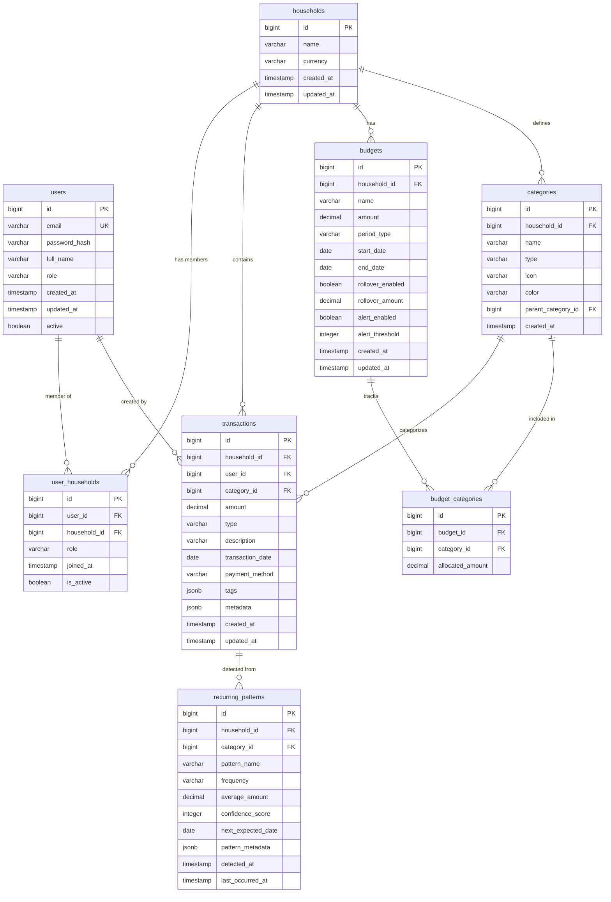

# Database Schema Design

## Overview
PostgreSQL 15+ relational database with 8 core entities supporting multi-user expense tracking, budgets, categories, and sharing.

---

## Entity Relationship Diagram



---

## Table Schemas

### 1. users
**Purpose:** User authentication and profile management

| Column | Type | Constraints | Description |
|--------|------|-------------|-------------|
| id | BIGSERIAL | PRIMARY KEY | Auto-incrementing user ID |
| email | VARCHAR(255) | UNIQUE, NOT NULL | Login email |
| password_hash | VARCHAR(255) | NOT NULL | BCrypt hashed password |
| full_name | VARCHAR(255) | NOT NULL | User's display name |
| role | VARCHAR(50) | NOT NULL, DEFAULT 'USER' | System role (USER, ADMIN) |
| created_at | TIMESTAMP | NOT NULL, DEFAULT NOW() | Account creation time |
| updated_at | TIMESTAMP | NOT NULL, DEFAULT NOW() | Last profile update |
| active | BOOLEAN | NOT NULL, DEFAULT true | Account status |

**Indexes:**
- `idx_users_email` ON email (for login queries)
- `idx_users_active` ON active (for filtering active users)

---

### 2. households
**Purpose:** Expense sharing groups (families, roommates, etc.)

| Column | Type | Constraints | Description |
|--------|------|-------------|-------------|
| id | BIGSERIAL | PRIMARY KEY | Household ID |
| name | VARCHAR(255) | NOT NULL | Household display name |
| currency | VARCHAR(3) | NOT NULL, DEFAULT 'USD' | ISO 4217 currency code |
| created_at | TIMESTAMP | NOT NULL, DEFAULT NOW() | Creation timestamp |
| updated_at | TIMESTAMP | NOT NULL, DEFAULT NOW() | Last update timestamp |

**Indexes:**
- `idx_households_created_at` ON created_at

---

### 3. user_households
**Purpose:** Many-to-many relationship with role-based access

| Column | Type | Constraints | Description |
|--------|------|-------------|-------------|
| id | BIGSERIAL | PRIMARY KEY | Relationship ID |
| user_id | BIGINT | FK → users.id, NOT NULL | User reference |
| household_id | BIGINT | FK → households.id, NOT NULL | Household reference |
| role | VARCHAR(50) | NOT NULL, DEFAULT 'VIEWER' | OWNER, ADMIN, VIEWER |
| joined_at | TIMESTAMP | NOT NULL, DEFAULT NOW() | Join timestamp |
| is_active | BOOLEAN | NOT NULL, DEFAULT true | Membership status |

**Constraints:**
- UNIQUE (user_id, household_id) - prevent duplicate memberships
- CHECK (role IN ('OWNER', 'ADMIN', 'VIEWER'))

**Indexes:**
- `idx_user_households_user` ON user_id
- `idx_user_households_household` ON household_id
- `idx_user_households_active` ON is_active

**Foreign Keys:**
- ON DELETE CASCADE for both user_id and household_id

---

### 4. categories
**Purpose:** Hierarchical expense/income categorization

| Column | Type | Constraints | Description |
|--------|------|-------------|-------------|
| id | BIGSERIAL | PRIMARY KEY | Category ID |
| household_id | BIGINT | FK → households.id, NOT NULL | Belongs to household |
| name | VARCHAR(100) | NOT NULL | Category name |
| type | VARCHAR(20) | NOT NULL | EXPENSE or INCOME |
| icon | VARCHAR(50) | NULL | Icon identifier (e.g., "shopping-cart") |
| color | VARCHAR(7) | NULL | Hex color code |
| parent_category_id | BIGINT | FK → categories.id, NULL | For subcategories |
| created_at | TIMESTAMP | NOT NULL, DEFAULT NOW() | Creation timestamp |

**Constraints:**
- UNIQUE (household_id, name, type) - prevent duplicate names per household
- CHECK (type IN ('EXPENSE', 'INCOME'))
- CHECK (parent_category_id != id) - prevent self-referencing

**Indexes:**
- `idx_categories_household` ON household_id
- `idx_categories_type` ON type
- `idx_categories_parent` ON parent_category_id

---

### 5. transactions
**Purpose:** Core financial transactions

| Column | Type | Constraints | Description |
|--------|------|-------------|-------------|
| id | BIGSERIAL | PRIMARY KEY | Transaction ID |
| household_id | BIGINT | FK → households.id, NOT NULL | Belongs to household |
| user_id | BIGINT | FK → users.id, NOT NULL | Created by user |
| category_id | BIGINT | FK → categories.id, NULL | Transaction category |
| amount | NUMERIC(15,2) | NOT NULL, CHECK (amount > 0) | Transaction amount |
| type | VARCHAR(20) | NOT NULL | EXPENSE or INCOME |
| description | TEXT | NULL | Transaction notes |
| transaction_date | DATE | NOT NULL | Date of transaction |
| payment_method | VARCHAR(50) | NULL | CASH, CARD, BANK_TRANSFER, etc. |
| tags | JSONB | NULL | Array of tags for filtering |
| metadata | JSONB | NULL | Additional flexible data |
| created_at | TIMESTAMP | NOT NULL, DEFAULT NOW() | Record creation |
| updated_at | TIMESTAMP | NOT NULL, DEFAULT NOW() | Last modification |

**Constraints:**
- CHECK (type IN ('EXPENSE', 'INCOME'))

**Indexes:**
- `idx_transactions_household` ON household_id
- `idx_transactions_user` ON user_id
- `idx_transactions_category` ON category_id
- `idx_transactions_date` ON transaction_date (for date range queries)
- `idx_transactions_type` ON type
- `idx_transactions_tags` GIN (tags) - for JSONB tag queries
- `idx_transactions_created_at` ON created_at

---

### 6. budgets
**Purpose:** Budget planning with rollover support

| Column | Type | Constraints | Description |
|--------|------|-------------|-------------|
| id | BIGSERIAL | PRIMARY KEY | Budget ID |
| household_id | BIGINT | FK → households.id, NOT NULL | Belongs to household |
| name | VARCHAR(255) | NOT NULL | Budget name |
| amount | NUMERIC(15,2) | NOT NULL, CHECK (amount >= 0) | Total budget amount |
| period_type | VARCHAR(20) | NOT NULL | MONTHLY, QUARTERLY, YEARLY |
| start_date | DATE | NOT NULL | Budget period start |
| end_date | DATE | NOT NULL | Budget period end |
| rollover_enabled | BOOLEAN | NOT NULL, DEFAULT false | Allow unused budget rollover |
| rollover_amount | NUMERIC(15,2) | NULL, DEFAULT 0 | Rolled over from previous period |
| alert_enabled | BOOLEAN | NOT NULL, DEFAULT true | Enable spending alerts |
| alert_threshold | INTEGER | NOT NULL, DEFAULT 80 | Alert at % (e.g., 80 = 80%) |
| created_at | TIMESTAMP | NOT NULL, DEFAULT NOW() | Creation timestamp |
| updated_at | TIMESTAMP | NOT NULL, DEFAULT NOW() | Last update |

**Constraints:**
- CHECK (period_type IN ('MONTHLY', 'QUARTERLY', 'YEARLY'))
- CHECK (end_date > start_date)
- CHECK (alert_threshold BETWEEN 1 AND 100)

**Indexes:**
- `idx_budgets_household` ON household_id
- `idx_budgets_dates` ON (start_date, end_date)

---

### 7. budget_categories
**Purpose:** Link budgets to specific categories

| Column | Type | Constraints | Description |
|--------|------|-------------|-------------|
| id | BIGSERIAL | PRIMARY KEY | Relationship ID |
| budget_id | BIGINT | FK → budgets.id, NOT NULL | Budget reference |
| category_id | BIGINT | FK → categories.id, NOT NULL | Category reference |
| allocated_amount | NUMERIC(15,2) | NOT NULL, CHECK (allocated_amount >= 0) | Amount allocated |

**Constraints:**
- UNIQUE (budget_id, category_id) - prevent duplicate allocations

**Indexes:**
- `idx_budget_categories_budget` ON budget_id
- `idx_budget_categories_category` ON category_id

**Foreign Keys:**
- ON DELETE CASCADE for both budget_id and category_id

---

### 8. recurring_patterns
**Purpose:** AI-detected recurring transactions

| Column | Type | Constraints | Description |
|--------|------|-------------|-------------|
| id | BIGSERIAL | PRIMARY KEY | Pattern ID |
| household_id | BIGINT | FK → households.id, NOT NULL | Belongs to household |
| category_id | BIGINT | FK → categories.id, NULL | Detected category |
| pattern_name | VARCHAR(255) | NOT NULL | Auto-generated name (e.g., "Netflix Subscription") |
| frequency | VARCHAR(20) | NOT NULL | DAILY, WEEKLY, MONTHLY, YEARLY |
| average_amount | NUMERIC(15,2) | NOT NULL | Average transaction amount |
| confidence_score | INTEGER | NOT NULL, CHECK (confidence_score BETWEEN 0 AND 100) | Detection confidence % |
| next_expected_date | DATE | NULL | Predicted next occurrence |
| pattern_metadata | JSONB | NULL | Detection algorithm details |
| detected_at | TIMESTAMP | NOT NULL, DEFAULT NOW() | First detection time |
| last_occurred_at | TIMESTAMP | NULL | Last confirmed occurrence |

**Constraints:**
- CHECK (frequency IN ('DAILY', 'WEEKLY', 'MONTHLY', 'YEARLY'))

**Indexes:**
- `idx_recurring_household` ON household_id
- `idx_recurring_next_date` ON next_expected_date

---

## SQL DDL Scripts

### Database Initialization

```sql
-- Create database
CREATE DATABASE expense_tracker
    WITH 
    ENCODING = 'UTF8'
    LC_COLLATE = 'en_US.UTF-8'
    LC_CTYPE = 'en_US.UTF-8';

\c expense_tracker;

-- Enable extensions
CREATE EXTENSION IF NOT EXISTS "uuid-ossp";
CREATE EXTENSION IF NOT EXISTS "pg_trgm"; -- For fuzzy text search

-- Set timezone
SET timezone = 'UTC';
```

### Table Creation (Flyway Migration V1)

```sql
-- V1__init_schema.sql

-- 1. users table
CREATE TABLE users (
    id BIGSERIAL PRIMARY KEY,
    email VARCHAR(255) UNIQUE NOT NULL,
    password_hash VARCHAR(255) NOT NULL,
    full_name VARCHAR(255) NOT NULL,
    role VARCHAR(50) NOT NULL DEFAULT 'USER',
    created_at TIMESTAMP NOT NULL DEFAULT NOW(),
    updated_at TIMESTAMP NOT NULL DEFAULT NOW(),
    active BOOLEAN NOT NULL DEFAULT true,
    CONSTRAINT chk_users_role CHECK (role IN ('USER', 'ADMIN'))
);

CREATE INDEX idx_users_email ON users(email);
CREATE INDEX idx_users_active ON users(active);

-- 2. households table
CREATE TABLE households (
    id BIGSERIAL PRIMARY KEY,
    name VARCHAR(255) NOT NULL,
    currency VARCHAR(3) NOT NULL DEFAULT 'USD',
    created_at TIMESTAMP NOT NULL DEFAULT NOW(),
    updated_at TIMESTAMP NOT NULL DEFAULT NOW()
);

CREATE INDEX idx_households_created_at ON households(created_at);

-- 3. user_households (junction table)
CREATE TABLE user_households (
    id BIGSERIAL PRIMARY KEY,
    user_id BIGINT NOT NULL REFERENCES users(id) ON DELETE CASCADE,
    household_id BIGINT NOT NULL REFERENCES households(id) ON DELETE CASCADE,
    role VARCHAR(50) NOT NULL DEFAULT 'VIEWER',
    joined_at TIMESTAMP NOT NULL DEFAULT NOW(),
    is_active BOOLEAN NOT NULL DEFAULT true,
    CONSTRAINT uq_user_household UNIQUE (user_id, household_id),
    CONSTRAINT chk_uh_role CHECK (role IN ('OWNER', 'ADMIN', 'VIEWER'))
);

CREATE INDEX idx_user_households_user ON user_households(user_id);
CREATE INDEX idx_user_households_household ON user_households(household_id);
CREATE INDEX idx_user_households_active ON user_households(is_active);

-- 4. categories table
CREATE TABLE categories (
    id BIGSERIAL PRIMARY KEY,
    household_id BIGINT NOT NULL REFERENCES households(id) ON DELETE CASCADE,
    name VARCHAR(100) NOT NULL,
    type VARCHAR(20) NOT NULL,
    icon VARCHAR(50),
    color VARCHAR(7),
    parent_category_id BIGINT REFERENCES categories(id) ON DELETE SET NULL,
    created_at TIMESTAMP NOT NULL DEFAULT NOW(),
    CONSTRAINT uq_category_name UNIQUE (household_id, name, type),
    CONSTRAINT chk_category_type CHECK (type IN ('EXPENSE', 'INCOME')),
    CONSTRAINT chk_no_self_parent CHECK (parent_category_id != id)
);

CREATE INDEX idx_categories_household ON categories(household_id);
CREATE INDEX idx_categories_type ON categories(type);
CREATE INDEX idx_categories_parent ON categories(parent_category_id);

-- 5. transactions table
CREATE TABLE transactions (
    id BIGSERIAL PRIMARY KEY,
    household_id BIGINT NOT NULL REFERENCES households(id) ON DELETE CASCADE,
    user_id BIGINT NOT NULL REFERENCES users(id) ON DELETE SET NULL,
    category_id BIGINT REFERENCES categories(id) ON DELETE SET NULL,
    amount NUMERIC(15,2) NOT NULL,
    type VARCHAR(20) NOT NULL,
    description TEXT,
    transaction_date DATE NOT NULL,
    payment_method VARCHAR(50),
    tags JSONB,
    metadata JSONB,
    created_at TIMESTAMP NOT NULL DEFAULT NOW(),
    updated_at TIMESTAMP NOT NULL DEFAULT NOW(),
    CONSTRAINT chk_amount_positive CHECK (amount > 0),
    CONSTRAINT chk_transaction_type CHECK (type IN ('EXPENSE', 'INCOME'))
);

CREATE INDEX idx_transactions_household ON transactions(household_id);
CREATE INDEX idx_transactions_user ON transactions(user_id);
CREATE INDEX idx_transactions_category ON transactions(category_id);
CREATE INDEX idx_transactions_date ON transactions(transaction_date);
CREATE INDEX idx_transactions_type ON transactions(type);
CREATE INDEX idx_transactions_tags ON transactions USING GIN(tags);
CREATE INDEX idx_transactions_created_at ON transactions(created_at);

-- 6. budgets table
CREATE TABLE budgets (
    id BIGSERIAL PRIMARY KEY,
    household_id BIGINT NOT NULL REFERENCES households(id) ON DELETE CASCADE,
    name VARCHAR(255) NOT NULL,
    amount NUMERIC(15,2) NOT NULL,
    period_type VARCHAR(20) NOT NULL,
    start_date DATE NOT NULL,
    end_date DATE NOT NULL,
    rollover_enabled BOOLEAN NOT NULL DEFAULT false,
    rollover_amount NUMERIC(15,2) DEFAULT 0,
    alert_enabled BOOLEAN NOT NULL DEFAULT true,
    alert_threshold INTEGER NOT NULL DEFAULT 80,
    created_at TIMESTAMP NOT NULL DEFAULT NOW(),
    updated_at TIMESTAMP NOT NULL DEFAULT NOW(),
    CONSTRAINT chk_budget_amount CHECK (amount >= 0),
    CONSTRAINT chk_rollover_amount CHECK (rollover_amount >= 0),
    CONSTRAINT chk_period_type CHECK (period_type IN ('MONTHLY', 'QUARTERLY', 'YEARLY')),
    CONSTRAINT chk_date_range CHECK (end_date > start_date),
    CONSTRAINT chk_alert_threshold CHECK (alert_threshold BETWEEN 1 AND 100)
);

CREATE INDEX idx_budgets_household ON budgets(household_id);
CREATE INDEX idx_budgets_dates ON budgets(start_date, end_date);

-- 7. budget_categories (junction table)
CREATE TABLE budget_categories (
    id BIGSERIAL PRIMARY KEY,
    budget_id BIGINT NOT NULL REFERENCES budgets(id) ON DELETE CASCADE,
    category_id BIGINT NOT NULL REFERENCES categories(id) ON DELETE CASCADE,
    allocated_amount NUMERIC(15,2) NOT NULL,
    CONSTRAINT uq_budget_category UNIQUE (budget_id, category_id),
    CONSTRAINT chk_allocated_amount CHECK (allocated_amount >= 0)
);

CREATE INDEX idx_budget_categories_budget ON budget_categories(budget_id);
CREATE INDEX idx_budget_categories_category ON budget_categories(category_id);

-- 8. recurring_patterns table
CREATE TABLE recurring_patterns (
    id BIGSERIAL PRIMARY KEY,
    household_id BIGINT NOT NULL REFERENCES households(id) ON DELETE CASCADE,
    category_id BIGINT REFERENCES categories(id) ON DELETE SET NULL,
    pattern_name VARCHAR(255) NOT NULL,
    frequency VARCHAR(20) NOT NULL,
    average_amount NUMERIC(15,2) NOT NULL,
    confidence_score INTEGER NOT NULL,
    next_expected_date DATE,
    pattern_metadata JSONB,
    detected_at TIMESTAMP NOT NULL DEFAULT NOW(),
    last_occurred_at TIMESTAMP,
    CONSTRAINT chk_frequency CHECK (frequency IN ('DAILY', 'WEEKLY', 'MONTHLY', 'YEARLY')),
    CONSTRAINT chk_confidence CHECK (confidence_score BETWEEN 0 AND 100)
);

CREATE INDEX idx_recurring_household ON recurring_patterns(household_id);
CREATE INDEX idx_recurring_next_date ON recurring_patterns(next_expected_date);
```

### Seed Data (Development)

```sql
-- V2__seed_data.sql

-- Insert default admin user (password: admin123)
INSERT INTO users (email, password_hash, full_name, role) VALUES
('admin@expensetracker.com', '$2a$10$XQq1H7wVqCEfQfhHF8x5YOtW8r3RxZ2M7dQKGwF4jN5xY8pK2nM3e', 'System Admin', 'ADMIN');

-- Insert demo household
INSERT INTO households (name, currency) VALUES
('Smith Family', 'USD');

-- Link admin to household as OWNER
INSERT INTO user_households (user_id, household_id, role) VALUES
(1, 1, 'OWNER');

-- Insert default categories
INSERT INTO categories (household_id, name, type, icon, color) VALUES
(1, 'Groceries', 'EXPENSE', 'shopping-cart', '#22c55e'),
(1, 'Utilities', 'EXPENSE', 'zap', '#3b82f6'),
(1, 'Transportation', 'EXPENSE', 'car', '#f59e0b'),
(1, 'Entertainment', 'EXPENSE', 'film', '#8b5cf6'),
(1, 'Healthcare', 'EXPENSE', 'heart', '#ef4444'),
(1, 'Salary', 'INCOME', 'dollar-sign', '#10b981'),
(1, 'Freelance', 'INCOME', 'briefcase', '#06b6d4');
```

---

## Database Views (Optional Performance Optimization)

### Transaction Summary View

```sql
CREATE OR REPLACE VIEW v_transaction_summary AS
SELECT 
    t.household_id,
    DATE_TRUNC('month', t.transaction_date) as month,
    t.type,
    c.name as category_name,
    COUNT(*) as transaction_count,
    SUM(t.amount) as total_amount,
    AVG(t.amount) as average_amount
FROM transactions t
LEFT JOIN categories c ON t.category_id = c.id
GROUP BY t.household_id, month, t.type, c.name;
```

### Budget Progress View

```sql
CREATE OR REPLACE VIEW v_budget_progress AS
SELECT 
    b.id as budget_id,
    b.household_id,
    b.name as budget_name,
    b.amount as budget_amount,
    b.start_date,
    b.end_date,
    COALESCE(SUM(t.amount), 0) as spent_amount,
    b.amount - COALESCE(SUM(t.amount), 0) as remaining_amount,
    ROUND((COALESCE(SUM(t.amount), 0) / b.amount * 100), 2) as percentage_used
FROM budgets b
LEFT JOIN budget_categories bc ON b.id = bc.budget_id
LEFT JOIN transactions t ON t.category_id = bc.category_id 
    AND t.transaction_date BETWEEN b.start_date AND b.end_date
    AND t.type = 'EXPENSE'
GROUP BY b.id, b.household_id, b.name, b.amount, b.start_date, b.end_date;
```

---

## Database Functions & Triggers

### Auto-update timestamp trigger

```sql
CREATE OR REPLACE FUNCTION update_updated_at_column()
RETURNS TRIGGER AS $$
BEGIN
    NEW.updated_at = NOW();
    RETURN NEW;
END;
$$ language 'plpgsql';

-- Apply to relevant tables
CREATE TRIGGER update_users_updated_at BEFORE UPDATE ON users
    FOR EACH ROW EXECUTE FUNCTION update_updated_at_column();

CREATE TRIGGER update_households_updated_at BEFORE UPDATE ON households
    FOR EACH ROW EXECUTE FUNCTION update_updated_at_column();

CREATE TRIGGER update_transactions_updated_at BEFORE UPDATE ON transactions
    FOR EACH ROW EXECUTE FUNCTION update_updated_at_column();

CREATE TRIGGER update_budgets_updated_at BEFORE UPDATE ON budgets
    FOR EACH ROW EXECUTE FUNCTION update_updated_at_column();
```

---

## Performance Considerations

1. **Partitioning Strategy (Future):** Partition `transactions` table by date for large datasets (> 1M rows)
2. **Archive Strategy:** Move transactions older than 2 years to `transactions_archive` table
3. **Query Optimization:** Use EXPLAIN ANALYZE for slow queries
4. **Connection Pooling:** Configure HikariCP with max pool size based on load
5. **Read Replicas:** Add read replicas for reporting queries in production

---

## Security Considerations

1. **Row-Level Security (RLS):** Consider enabling RLS for multi-tenant isolation
2. **Encryption at Rest:** Enable PostgreSQL transparent data encryption
3. **Sensitive Data:** Store JWT secrets in environment variables, never in database
4. **SQL Injection:** Use parameterized queries (JPA handles this)
5. **Backup Strategy:** Daily full backups + continuous WAL archiving

---

## Migration Strategy

Use **Flyway** for version-controlled database migrations:

```
src/main/resources/db/migration/
├── V1__init_schema.sql
├── V2__seed_data.sql
├── V3__add_transaction_tags.sql
└── V4__create_views.sql
```

**Naming Convention:** `V{version}__{description}.sql`

---

## Backup & Recovery

```bash
# Backup
pg_dump -U postgres -d expense_tracker -F c -f backup_$(date +%Y%m%d).dump

# Restore
pg_restore -U postgres -d expense_tracker -c backup_20260804.dump
```

---

**Document Version:** 1.0  
**Last Updated:** August 4, 2026  
**Owner:** Backend Team
