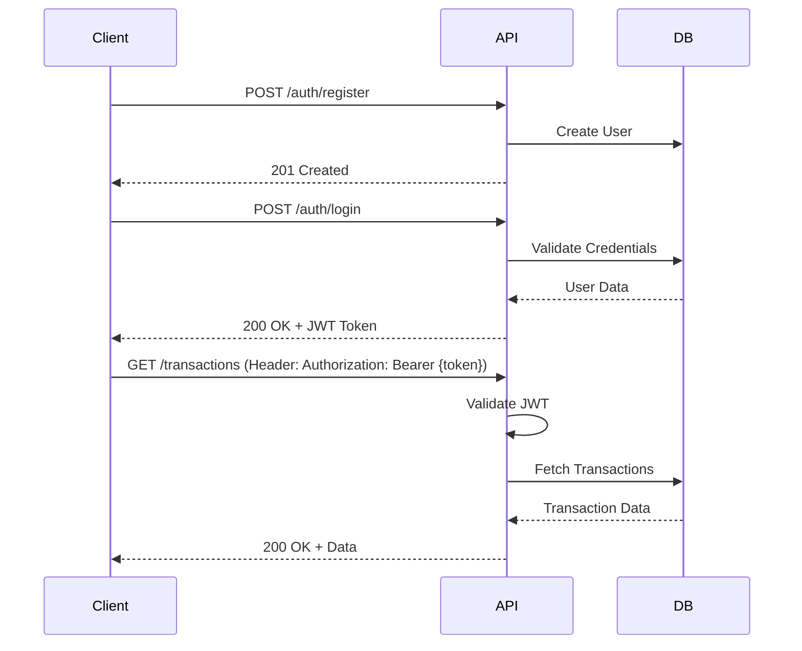

# API Specification

## Overview

RESTful API for Expense Tracker with JWT authentication, role-based authorization, and comprehensive CRUD operations.

**Base URL:** `http://localhost:8080/api/v1`  
**Production:** `https://api.expensetracker.com/api/v1`  
**API Version:** 1.0  
**Authentication:** Bearer JWT Token

---

## Authentication & Authorization

### Authentication Flow



---

## Authentication Endpoints

### 1. Register User

**Endpoint:** `POST /api/v1/auth/register`  
**Authentication:** None  
**Description:** Create a new user account

**Request Body:**
```json
{
  "email": "john.doe@example.com",
  "password": "SecurePass123!",
  "fullName": "John Doe"
}
```

**Validation Rules:**
- Email: Valid format, unique
- Password: Min 8 chars, 1 uppercase, 1 lowercase, 1 number, 1 special char
- Full Name: 2-255 chars

**Success Response:** `201 Created`
```json
{
  "id": 1,
  "email": "john.doe@example.com",
  "fullName": "John Doe",
  "role": "USER",
  "createdAt": "2026-08-04T03:56:34.479Z"
}
```

**Error Responses:**
- `400 Bad Request` - Validation errors
```json
{
  "error": "BAD_REQUEST",
  "message": "Email already exists",
  "timestamp": "2026-08-04T03:56:34.479Z"
}
```

---

### 2. Login

**Endpoint:** `POST /api/v1/auth/login`  
**Authentication:** None

**Request Body:**
```json
{
  "email": "john.doe@example.com",
  "password": "SecurePass123!"
}
```

**Success Response:** `200 OK`
```json
{
  "token": "eyJhbGciOiJIUzI1NiIsInR5cCI6IkpXVCJ9...",
  "type": "Bearer",
  "expiresIn": 86400,
  "user": {
    "id": 1,
    "email": "john.doe@example.com",
    "fullName": "John Doe",
    "role": "USER"
  }
}
```

**Error Responses:**
- `401 Unauthorized` - Invalid credentials

---

### 3. Refresh Token

**Endpoint:** `POST /api/v1/auth/refresh`  
**Authentication:** Valid JWT (even if expired < 7 days)

**Request Body:**
```json
{
  "refreshToken": "eyJhbGciOiJIUzI1NiIsInR5cCI6IkpXVCJ9..."
}
```

**Success Response:** `200 OK`
```json
{
  "token": "eyJhbGciOiJIUzI1NiIsInR5cCI6IkpXVCJ9...",
  "expiresIn": 86400
}
```

---

### 4. Logout

**Endpoint:** `POST /api/v1/auth/logout`  
**Authentication:** Required

**Success Response:** `204 No Content`

---

## User Management Endpoints

### 5. Get Current User Profile

**Endpoint:** `GET /api/v1/users/me`  
**Authentication:** Required

**Success Response:** `200 OK`
```json
{
  "id": 1,
  "email": "john.doe@example.com",
  "fullName": "John Doe",
  "role": "USER",
  "active": true,
  "createdAt": "2026-07-01T10:00:00Z",
  "updatedAt": "2026-08-04T03:56:34Z"
}
```

---

### 6. Update User Profile

**Endpoint:** `PUT /api/v1/users/me`  
**Authentication:** Required

**Request Body:**
```json
{
  "fullName": "John Michael Doe",
  "email": "john.m.doe@example.com"
}
```

**Success Response:** `200 OK`
```json
{
  "id": 1,
  "email": "john.m.doe@example.com",
  "fullName": "John Michael Doe",
  "role": "USER",
  "updatedAt": "2026-08-04T03:56:34Z"
}
```

---

### 7. Change Password

**Endpoint:** `POST /api/v1/users/me/change-password`  
**Authentication:** Required

**Request Body:**
```json
{
  "currentPassword": "OldPass123!",
  "newPassword": "NewSecurePass456!"
}
```

**Success Response:** `200 OK`
```json
{
  "message": "Password changed successfully"
}
```

---

## Household Management Endpoints

### 8. Create Household

**Endpoint:** `POST /api/v1/households`  
**Authentication:** Required  
**Description:** Creates a household and makes the creator the OWNER

**Request Body:**
```json
{
  "name": "Smith Family",
  "currency": "USD"
}
```

**Success Response:** `201 Created`
```json
{
  "id": 1,
  "name": "Smith Family",
  "currency": "USD",
  "createdAt": "2026-08-04T03:56:34Z",
  "memberCount": 1,
  "yourRole": "OWNER"
}
```

---

### 9. Get User's Households

**Endpoint:** `GET /api/v1/households`  
**Authentication:** Required

**Query Parameters:**
- `page` (default: 0)
- `size` (default: 20)
- `sort` (default: createdAt,desc)

**Success Response:** `200 OK`
```json
{
  "content": [
    {
      "id": 1,
      "name": "Smith Family",
      "currency": "USD",
      "memberCount": 3,
      "yourRole": "OWNER",
      "createdAt": "2026-08-04T03:56:34Z"
    },
    {
      "id": 2,
      "name": "Roommates",
      "currency": "USD",
      "memberCount": 4,
      "yourRole": "ADMIN",
      "createdAt": "2026-07-15T10:00:00Z"
    }
  ],
  "page": 0,
  "size": 20,
  "totalElements": 2,
  "totalPages": 1
}
```

---

### 10. Get Household Details

**Endpoint:** `GET /api/v1/households/{householdId}`  
**Authentication:** Required  
**Authorization:** Must be a member

**Success Response:** `200 OK`
```json
{
  "id": 1,
  "name": "Smith Family",
  "currency": "USD",
  "createdAt": "2026-08-04T03:56:34Z",
  "members": [
    {
      "userId": 1,
      "fullName": "John Doe",
      "email": "john@example.com",
      "role": "OWNER",
      "joinedAt": "2026-08-04T03:56:34Z",
      "isActive": true
    },
    {
      "userId": 2,
      "fullName": "Jane Doe",
      "email": "jane@example.com",
      "role": "ADMIN",
      "joinedAt": "2026-08-05T08:30:00Z",
      "isActive": true
    }
  ]
}
```

---

### 11. Invite User to Household

**Endpoint:** `POST /api/v1/households/{householdId}/members`  
**Authentication:** Required  
**Authorization:** OWNER or ADMIN

**Request Body:**
```json
{
  "email": "newmember@example.com",
  "role": "VIEWER"
}
```

**Success Response:** `201 Created`
```json
{
  "invitationId": "uuid-here",
  "email": "newmember@example.com",
  "role": "VIEWER",
  "status": "PENDING",
  "expiresAt": "2026-08-11T03:56:34Z"
}
```

---

### 12. Update Member Role

**Endpoint:** `PATCH /api/v1/households/{householdId}/members/{userId}`  
**Authentication:** Required  
**Authorization:** OWNER only

**Request Body:**
```json
{
  "role": "ADMIN"
}
```

**Success Response:** `200 OK`

---

### 13. Remove Member

**Endpoint:** `DELETE /api/v1/households/{householdId}/members/{userId}`  
**Authentication:** Required  
**Authorization:** OWNER only (cannot remove self)

**Success Response:** `204 No Content`

---

## Category Management Endpoints

### 14. Get Categories

**Endpoint:** `GET /api/v1/households/{householdId}/categories`  
**Authentication:** Required  
**Authorization:** Must be household member

**Query Parameters:**
- `type` (optional): EXPENSE | INCOME
- `includeSubcategories` (default: true)

**Success Response:** `200 OK`
```json
{
  "categories": [
    {
      "id": 1,
      "name": "Groceries",
      "type": "EXPENSE",
      "icon": "shopping-cart",
      "color": "#22c55e",
      "parentCategoryId": null,
      "subcategories": [
        {
          "id": 8,
          "name": "Organic Foods",
          "type": "EXPENSE",
          "icon": "leaf",
          "color": "#22c55e",
          "parentCategoryId": 1
        }
      ]
    }
  ]
}
```

---

### 15. Create Category

**Endpoint:** `POST /api/v1/households/{householdId}/categories`  
**Authentication:** Required  
**Authorization:** OWNER or ADMIN

**Request Body:**
```json
{
  "name": "Groceries",
  "type": "EXPENSE",
  "icon": "shopping-cart",
  "color": "#22c55e",
  "parentCategoryId": null
}
```

**Success Response:** `201 Created`

---

### 16. Update Category

**Endpoint:** `PUT /api/v1/households/{householdId}/categories/{categoryId}`  
**Authentication:** Required  
**Authorization:** OWNER or ADMIN

**Request Body:**
```json
{
  "name": "Grocery Shopping",
  "icon": "shopping-bag",
  "color": "#10b981"
}
```

**Success Response:** `200 OK`

---

### 17. Delete Category

**Endpoint:** `DELETE /api/v1/households/{householdId}/categories/{categoryId}`  
**Authentication:** Required  
**Authorization:** OWNER or ADMIN  
**Note:** Transactions will have category_id set to NULL

**Success Response:** `204 No Content`

---

## Transaction Endpoints

### 18. Get Transactions

**Endpoint:** `GET /api/v1/households/{householdId}/transactions`  
**Authentication:** Required  
**Authorization:** Must be household member

**Query Parameters:**
- `page` (default: 0)
- `size` (default: 50)
- `sort` (default: transactionDate,desc)
- `type` (optional): EXPENSE | INCOME
- `categoryId` (optional): Filter by category
- `startDate` (optional): ISO date (YYYY-MM-DD)
- `endDate` (optional): ISO date
- `minAmount` (optional): Decimal
- `maxAmount` (optional): Decimal
- `tags` (optional): Comma-separated tags
- `search` (optional): Search in description

**Success Response:** `200 OK`
```json
{
  "content": [
    {
      "id": 1,
      "householdId": 1,
      "categoryId": 1,
      "categoryName": "Groceries",
      "amount": 125.50,
      "type": "EXPENSE",
      "description": "Weekly grocery shopping at Walmart",
      "transactionDate": "2026-08-03",
      "paymentMethod": "CARD",
      "tags": ["groceries", "weekly"],
      "createdBy": {
        "userId": 1,
        "fullName": "John Doe"
      },
      "createdAt": "2026-08-03T14:30:00Z",
      "updatedAt": "2026-08-03T14:30:00Z"
    }
  ],
  "page": 0,
  "size": 50,
  "totalElements": 234,
  "totalPages": 5,
  "summary": {
    "totalExpense": 3250.75,
    "totalIncome": 5000.00,
    "netAmount": 1749.25
  }
}
```

---

### 19. Create Transaction

**Endpoint:** `POST /api/v1/households/{householdId}/transactions`  
**Authentication:** Required  
**Authorization:** OWNER or ADMIN

**Request Body:**
```json
{
  "categoryId": 1,
  "amount": 125.50,
  "type": "EXPENSE",
  "description": "Weekly grocery shopping",
  "transactionDate": "2026-08-03",
  "paymentMethod": "CARD",
  "tags": ["groceries", "weekly"]
}
```

**Success Response:** `201 Created`
```json
{
  "id": 1,
  "householdId": 1,
  "categoryId": 1,
  "amount": 125.50,
  "type": "EXPENSE",
  "description": "Weekly grocery shopping",
  "transactionDate": "2026-08-03",
  "paymentMethod": "CARD",
  "tags": ["groceries", "weekly"],
  "createdBy": {
    "userId": 1,
    "fullName": "John Doe"
  },
  "createdAt": "2026-08-03T14:30:00Z"
}
```

---

### 20. Update Transaction

**Endpoint:** `PUT /api/v1/households/{householdId}/transactions/{transactionId}`  
**Authentication:** Required  
**Authorization:** OWNER, ADMIN, or creator

**Request Body:**
```json
{
  "categoryId": 1,
  "amount": 130.00,
  "description": "Weekly grocery shopping - updated amount",
  "transactionDate": "2026-08-03"
}
```

**Success Response:** `200 OK`

---

### 21. Delete Transaction

**Endpoint:** `DELETE /api/v1/households/{householdId}/transactions/{transactionId}`  
**Authentication:** Required  
**Authorization:** OWNER, ADMIN, or creator

**Success Response:** `204 No Content`

---

### 22. Bulk Create Transactions

**Endpoint:** `POST /api/v1/households/{householdId}/transactions/bulk`  
**Authentication:** Required  
**Authorization:** OWNER or ADMIN

**Request Body:**
```json
{
  "transactions": [
    {
      "categoryId": 1,
      "amount": 50.00,
      "type": "EXPENSE",
      "description": "Coffee",
      "transactionDate": "2026-08-01"
    },
    {
      "categoryId": 2,
      "amount": 100.00,
      "type": "EXPENSE",
      "description": "Electric bill",
      "transactionDate": "2026-08-02"
    }
  ]
}
```

**Success Response:** `201 Created`
```json
{
  "created": 2,
  "failed": 0,
  "transactions": [...]
}
```

---

## Budget Endpoints

### 23. Get Budgets

**Endpoint:** `GET /api/v1/households/{householdId}/budgets`  
**Authentication:** Required  
**Authorization:** Must be household member

**Query Parameters:**
- `status` (optional): ACTIVE | EXPIRED | UPCOMING
- `periodType` (optional): MONTHLY | QUARTERLY | YEARLY

**Success Response:** `200 OK`
```json
{
  "budgets": [
    {
      "id": 1,
      "householdId": 1,
      "name": "August Budget",
      "amount": 2000.00,
      "periodType": "MONTHLY",
      "startDate": "2026-08-01",
      "endDate": "2026-08-31",
      "rolloverEnabled": true,
      "rolloverAmount": 150.00,
      "alertEnabled": true,
      "alertThreshold": 80,
      "spent": 1650.00,
      "remaining": 350.00,
      "percentageUsed": 82.5,
      "status": "ACTIVE",
      "categories": [
        {
          "categoryId": 1,
          "categoryName": "Groceries",
          "allocatedAmount": 500.00,
          "spent": 425.00
        }
      ]
    }
  ]
}
```

---

### 24. Create Budget

**Endpoint:** `POST /api/v1/households/{householdId}/budgets`  
**Authentication:** Required  
**Authorization:** OWNER or ADMIN

**Request Body:**
```json
{
  "name": "August Budget",
  "amount": 2000.00,
  "periodType": "MONTHLY",
  "startDate": "2026-08-01",
  "endDate": "2026-08-31",
  "rolloverEnabled": true,
  "alertEnabled": true,
  "alertThreshold": 80,
  "categories": [
    {
      "categoryId": 1,
      "allocatedAmount": 500.00
    },
    {
      "categoryId": 2,
      "allocatedAmount": 200.00
    }
  ]
}
```

**Success Response:** `201 Created`

---

### 25. Update Budget

**Endpoint:** `PUT /api/v1/households/{householdId}/budgets/{budgetId}`  
**Authentication:** Required  
**Authorization:** OWNER or ADMIN

**Request Body:**
```json
{
  "name": "August Budget - Revised",
  "amount": 2200.00,
  "alertThreshold": 85
}
```

**Success Response:** `200 OK`

---

### 26. Delete Budget

**Endpoint:** `DELETE /api/v1/households/{householdId}/budgets/{budgetId}`  
**Authentication:** Required  
**Authorization:** OWNER or ADMIN

**Success Response:** `204 No Content`

---

### 27. Get Budget Progress

**Endpoint:** `GET /api/v1/households/{householdId}/budgets/{budgetId}/progress`  
**Authentication:** Required

**Success Response:** `200 OK`
```json
{
  "budgetId": 1,
  "name": "August Budget",
  "totalAmount": 2000.00,
  "spent": 1650.00,
  "remaining": 350.00,
  "percentageUsed": 82.5,
  "daysRemaining": 27,
  "dailyAverageSpent": 55.00,
  "projectedTotal": 1705.00,
  "categories": [
    {
      "categoryId": 1,
      "categoryName": "Groceries",
      "allocated": 500.00,
      "spent": 425.00,
      "remaining": 75.00,
      "percentageUsed": 85.0
    }
  ]
}
```

---

## Analytics Endpoints

### 28. Get Dashboard Summary

**Endpoint:** `GET /api/v1/households/{householdId}/analytics/dashboard`  
**Authentication:** Required  
**Authorization:** Must be household member

**Query Parameters:**
- `startDate` (optional): Default to current month start
- `endDate` (optional): Default to current month end

**Success Response:** `200 OK`
```json
{
  "period": {
    "startDate": "2026-08-01",
    "endDate": "2026-08-31"
  },
  "summary": {
    "totalIncome": 5000.00,
    "totalExpense": 3250.75,
    "netAmount": 1749.25,
    "transactionCount": 45
  },
  "topCategories": [
    {
      "categoryId": 1,
      "categoryName": "Groceries",
      "amount": 850.00,
      "percentage": 26.2
    }
  ],
  "dailyTrend": [
    {
      "date": "2026-08-01",
      "income": 5000.00,
      "expense": 150.00
    }
  ],
  "budgetAlerts": [
    {
      "budgetId": 1,
      "budgetName": "August Budget",
      "percentageUsed": 82.5,
      "status": "WARNING"
    }
  ]
}
```

---

### 29. Get Spending Trends

**Endpoint:** `GET /api/v1/households/{householdId}/analytics/trends`  
**Authentication:** Required

**Query Parameters:**
- `startDate` (required)
- `endDate` (required)
- `groupBy` (default: month): day | week | month | quarter

**Success Response:** `200 OK`
```json
{
  "trends": [
    {
      "period": "2026-08",
      "income": 5000.00,
      "expense": 3250.75,
      "net": 1749.25,
      "transactionCount": 45
    },
    {
      "period": "2026-07",
      "income": 5000.00,
      "expense": 3100.50,
      "net": 1899.50,
      "transactionCount": 42
    }
  ]
}
```

---

### 30. Get Category Breakdown

**Endpoint:** `GET /api/v1/households/{householdId}/analytics/categories`  
**Authentication:** Required

**Query Parameters:**
- `startDate` (required)
- `endDate` (required)
- `type` (optional): EXPENSE | INCOME

**Success Response:** `200 OK`
```json
{
  "categories": [
    {
      "categoryId": 1,
      "categoryName": "Groceries",
      "amount": 850.00,
      "percentage": 26.2,
      "transactionCount": 12,
      "averageAmount": 70.83
    }
  ],
  "totalAmount": 3250.75
}
```

---

### 31. Get Predictions

**Endpoint:** `GET /api/v1/households/{householdId}/analytics/predictions`  
**Authentication:** Required  
**Description:** ML-based spending predictions

**Success Response:** `200 OK`
```json
{
  "nextMonth": {
    "predictedExpense": 3300.00,
    "confidence": 85,
    "basedOnMonths": 6
  },
  "recurringTransactions": [
    {
      "patternId": 1,
      "description": "Netflix Subscription",
      "predictedAmount": 15.99,
      "predictedDate": "2026-09-05",
      "frequency": "MONTHLY",
      "confidence": 95
    }
  ]
}
```

---

## Recurring Patterns Endpoints

### 32. Get Recurring Patterns

**Endpoint:** `GET /api/v1/households/{householdId}/recurring-patterns`  
**Authentication:** Required

**Success Response:** `200 OK`
```json
{
  "patterns": [
    {
      "id": 1,
      "householdId": 1,
      "categoryId": 4,
      "categoryName": "Entertainment",
      "patternName": "Netflix Subscription",
      "frequency": "MONTHLY",
      "averageAmount": 15.99,
      "confidenceScore": 95,
      "nextExpectedDate": "2026-09-05",
      "lastOccurredAt": "2026-08-05T00:00:00Z",
      "detectedAt": "2026-07-01T10:00:00Z"
    }
  ]
}
```

---

### 33. Confirm Recurring Pattern

**Endpoint:** `POST /api/v1/households/{householdId}/recurring-patterns/{patternId}/confirm`  
**Authentication:** Required  
**Authorization:** OWNER or ADMIN

**Success Response:** `200 OK`

---

### 34. Dismiss Recurring Pattern

**Endpoint:** `DELETE /api/v1/households/{householdId}/recurring-patterns/{patternId}`  
**Authentication:** Required  
**Authorization:** OWNER or ADMIN

**Success Response:** `204 No Content`

---

## Export Endpoints

### 35. Export Transactions (CSV)

**Endpoint:** `GET /api/v1/households/{householdId}/export/transactions/csv`  
**Authentication:** Required

**Query Parameters:**
- `startDate` (optional)
- `endDate` (optional)
- `categoryId` (optional)

**Success Response:** `200 OK`  
**Content-Type:** `text/csv`  
**Filename:** `transactions_20260804.csv`

---

### 36. Export Report (PDF)

**Endpoint:** `POST /api/v1/households/{householdId}/export/report/pdf`  
**Authentication:** Required

**Request Body:**
```json
{
  "startDate": "2026-08-01",
  "endDate": "2026-08-31",
  "includeCharts": true,
  "includeTransactions": true
}
```

**Success Response:** `200 OK`  
**Content-Type:** `application/pdf`

---

## Error Response Format

All error responses follow this structure:

```json
{
  "error": "ERROR_CODE",
  "message": "Human-readable error message",
  "timestamp": "2026-08-04T03:56:34.479Z",
  "path": "/api/v1/households/1/transactions",
  "details": {
    "field": "amount",
    "reason": "must be greater than 0"
  }
}
```

**Common Error Codes:**
- `BAD_REQUEST` (400) - Validation errors
- `UNAUTHORIZED` (401) - Authentication failed
- `FORBIDDEN` (403) - Insufficient permissions
- `NOT_FOUND` (404) - Resource not found
- `CONFLICT` (409) - Duplicate resource
- `INTERNAL_SERVER_ERROR` (500) - Server error

---

## Rate Limiting

- **Limit:** 100 requests per minute per user
- **Headers:**
  - `X-RateLimit-Limit: 100`
  - `X-RateLimit-Remaining: 95`
  - `X-RateLimit-Reset: 1691137594`

**Response on Limit Exceeded:** `429 Too Many Requests`

---

## Pagination

All list endpoints support pagination with these parameters:
- `page` - Zero-indexed page number (default: 0)
- `size` - Items per page (default: 20, max: 100)
- `sort` - Sort field and direction (e.g., `createdAt,desc`)

**Response includes:**
```json
{
  "content": [...],
  "page": 0,
  "size": 20,
  "totalElements": 234,
  "totalPages": 12
}
```

---

## API Versioning Strategy

- **Current:** v1
- **URL-based versioning:** `/api/v1/...`
- **Backward compatibility:** Maintained for 12 months
- **Deprecation notice:** Via `X-API-Deprecated` header

---

## OpenAPI/Swagger Documentation

**Swagger UI:** `http://localhost:8080/swagger-ui.html`  
**OpenAPI JSON:** `http://localhost:8080/v3/api-docs`

---

**Document Version:** 1.0  
**Last Updated:** August 4, 2026  
**Owner:** Backend Team
