# Architecture Diagrams

## Overview

This document provides comprehensive architecture diagrams for the Expense Tracker application using C4 model and component diagrams.

---

## 1. System Context Diagram (C4 Level 1)

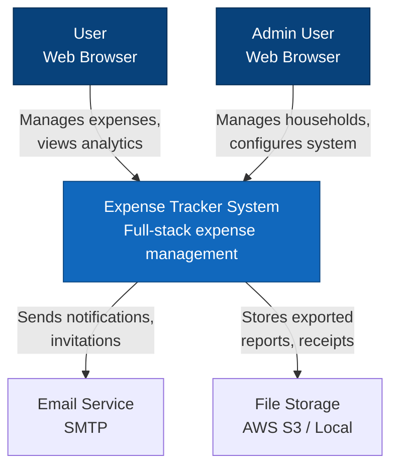

---

## 2. Container Diagram (C4 Level 2)

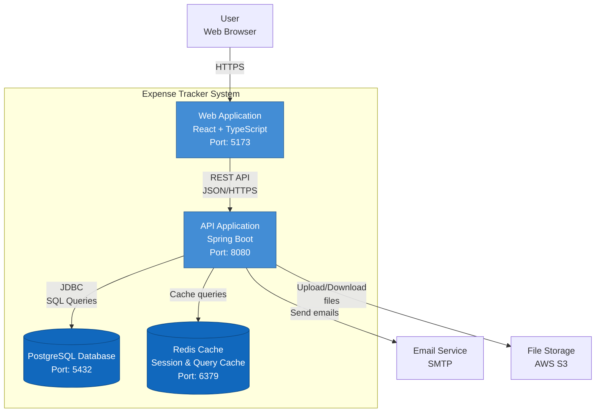

---

## 3. Component Diagram - Backend (C4 Level 3)

```mermaid
graph TB
    subgraph "API Application - Spring Boot"
        SecurityFilter[Security Filter<br/>JWT Validation]
        
        subgraph "Controllers"
            AuthController[Auth Controller]
            UserController[User Controller]
            HouseholdController[Household Controller]
            TransactionController[Transaction Controller]
            BudgetController[Budget Controller]
            AnalyticsController[Analytics Controller]
        end
        
        subgraph "Services"
            AuthService[Auth Service]
            UserService[User Service]
            HouseholdService[Household Service]
            TransactionService[Transaction Service]
            BudgetService[Budget Service]
            AnalyticsService[Analytics Service]
            RecurringPatternService[Recurring Pattern Service]
        end
        
        subgraph "Repositories"
            UserRepo[User Repository]
            HouseholdRepo[Household Repository]
            TransactionRepo[Transaction Repository]
            BudgetRepo[Budget Repository]
            CategoryRepo[Category Repository]
        end
        
        subgraph "External Services"
            EmailService[Email Service]
            StorageService[Storage Service]
            PDFGenerator[PDF Generator]
        end
    end
    
    WebApp[Web Application] -->|REST Calls| SecurityFilter
    SecurityFilter --> AuthController
    SecurityFilter --> UserController
    SecurityFilter --> HouseholdController
    SecurityFilter --> TransactionController
    SecurityFilter --> BudgetController
    SecurityFilter --> AnalyticsController
    
    AuthController --> AuthService
    UserController --> UserService
    HouseholdController --> HouseholdService
    TransactionController --> TransactionService
    BudgetController --> BudgetService
    AnalyticsController --> AnalyticsService
    
    TransactionService --> RecurringPatternService
    
    AuthService --> UserRepo
    UserService --> UserRepo
    HouseholdService --> HouseholdRepo
    TransactionService --> TransactionRepo
    BudgetService --> BudgetRepo
    TransactionService --> CategoryRepo
    
    AuthService --> EmailService
    AnalyticsService --> PDFGenerator
    TransactionService --> StorageService
    
    UserRepo --> DB[(Database)]
    HouseholdRepo --> DB
    TransactionRepo --> DB
    BudgetRepo --> DB
    CategoryRepo --> DB
    
    style SecurityFilter fill:#ff6b6b,stroke:#c92a2a,color:#ffffff
```

---

## 4. Component Diagram - Frontend (React)

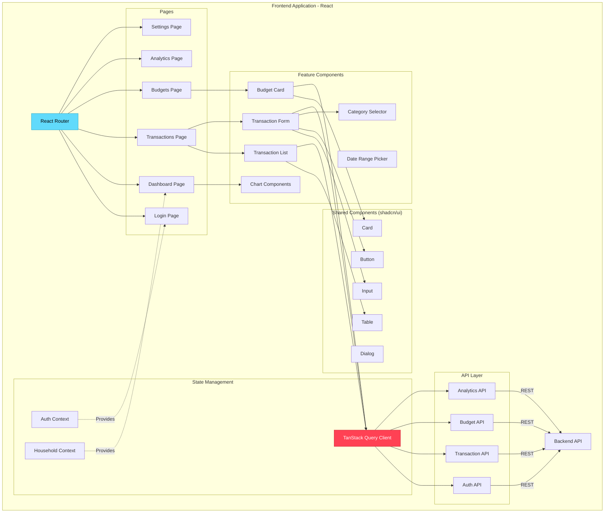

---

## 5. Frontend Folder Structure

```
frontend/
├── src/
│   ├── components/
│   │   ├── ui/                    # shadcn/ui components
│   │   │   ├── button.tsx
│   │   │   ├── input.tsx
│   │   │   ├── dialog.tsx
│   │   │   ├── table.tsx
│   │   │   └── card.tsx
│   │   ├── layout/
│   │   │   ├── AppLayout.tsx      # Main app layout with sidebar
│   │   │   ├── Navbar.tsx
│   │   │   └── Sidebar.tsx
│   │   ├── transactions/
│   │   │   ├── TransactionList.tsx
│   │   │   ├── TransactionForm.tsx
│   │   │   ├── TransactionFilters.tsx
│   │   │   └── TransactionCard.tsx
│   │   ├── budgets/
│   │   │   ├── BudgetCard.tsx
│   │   │   ├── BudgetForm.tsx
│   │   │   ├── BudgetProgress.tsx
│   │   │   └── BudgetAlerts.tsx
│   │   ├── analytics/
│   │   │   ├── SpendingChart.tsx
│   │   │   ├── CategoryPieChart.tsx
│   │   │   ├── TrendLineChart.tsx
│   │   │   └── DashboardCard.tsx
│   │   ├── categories/
│   │   │   ├── CategorySelector.tsx
│   │   │   ├── CategoryManager.tsx
│   │   │   └── CategoryIcon.tsx
│   │   └── shared/
│   │       ├── DateRangePicker.tsx
│   │       ├── CurrencyInput.tsx
│   │       ├── LoadingSpinner.tsx
│   │       └── ErrorBoundary.tsx
│   ├── pages/
│   │   ├── auth/
│   │   │   ├── LoginPage.tsx
│   │   │   └── RegisterPage.tsx
│   │   ├── DashboardPage.tsx
│   │   ├── TransactionsPage.tsx
│   │   ├── BudgetsPage.tsx
│   │   ├── AnalyticsPage.tsx
│   │   ├── CategoriesPage.tsx
│   │   ├── HouseholdsPage.tsx
│   │   └── SettingsPage.tsx
│   ├── api/
│   │   ├── client.ts              # Axios instance with interceptors
│   │   ├── auth.api.ts
│   │   ├── transactions.api.ts
│   │   ├── budgets.api.ts
│   │   ├── categories.api.ts
│   │   ├── households.api.ts
│   │   └── analytics.api.ts
│   ├── hooks/
│   │   ├── useAuth.ts
│   │   ├── useTransactions.ts     # TanStack Query hooks
│   │   ├── useBudgets.ts
│   │   ├── useCategories.ts
│   │   └── useHouseholds.ts
│   ├── contexts/
│   │   ├── AuthContext.tsx
│   │   └── HouseholdContext.tsx
│   ├── types/
│   │   ├── auth.types.ts
│   │   ├── transaction.types.ts
│   │   ├── budget.types.ts
│   │   └── api.types.ts
│   ├── utils/
│   │   ├── formatters.ts          # Currency, date formatting
│   │   ├── validators.ts
│   │   └── constants.ts
│   ├── lib/
│   │   └── utils.ts               # shadcn/ui utility functions
│   ├── App.tsx
│   ├── main.tsx
│   └── routes.tsx
├── public/
├── package.json
├── vite.config.ts
├── tailwind.config.js
└── tsconfig.json
```

---

## 6. Backend Folder Structure

```
backend/
├── src/main/java/com/expensetracker/
│   ├── ExpenseTrackerApplication.java
│   ├── config/
│   │   ├── SecurityConfig.java        # Spring Security configuration
│   │   ├── JwtConfig.java
│   │   ├── CorsConfig.java
│   │   ├── OpenApiConfig.java         # Swagger configuration
│   │   └── CacheConfig.java
│   ├── security/
│   │   ├── JwtTokenProvider.java
│   │   ├── JwtAuthenticationFilter.java
│   │   ├── UserDetailsServiceImpl.java
│   │   └── SecurityUtils.java
│   ├── controller/
│   │   ├── AuthController.java
│   │   ├── UserController.java
│   │   ├── HouseholdController.java
│   │   ├── CategoryController.java
│   │   ├── TransactionController.java
│   │   ├── BudgetController.java
│   │   ├── AnalyticsController.java
│   │   └── ExportController.java
│   ├── service/
│   │   ├── AuthService.java
│   │   ├── UserService.java
│   │   ├── HouseholdService.java
│   │   ├── CategoryService.java
│   │   ├── TransactionService.java
│   │   ├── BudgetService.java
│   │   ├── AnalyticsService.java
│   │   ├── RecurringPatternService.java
│   │   ├── EmailService.java
│   │   ├── StorageService.java
│   │   └── PdfGeneratorService.java
│   ├── repository/
│   │   ├── UserRepository.java
│   │   ├── HouseholdRepository.java
│   │   ├── UserHouseholdRepository.java
│   │   ├── CategoryRepository.java
│   │   ├── TransactionRepository.java
│   │   ├── BudgetRepository.java
│   │   ├── BudgetCategoryRepository.java
│   │   └── RecurringPatternRepository.java
│   ├── model/
│   │   ├── entity/
│   │   │   ├── User.java
│   │   │   ├── Household.java
│   │   │   ├── UserHousehold.java
│   │   │   ├── Category.java
│   │   │   ├── Transaction.java
│   │   │   ├── Budget.java
│   │   │   ├── BudgetCategory.java
│   │   │   └── RecurringPattern.java
│   │   └── enums/
│   │       ├── Role.java
│   │       ├── TransactionType.java
│   │       ├── PeriodType.java
│   │       └── Frequency.java
│   ├── dto/
│   │   ├── request/
│   │   │   ├── LoginRequest.java
│   │   │   ├── RegisterRequest.java
│   │   │   ├── TransactionRequest.java
│   │   │   ├── BudgetRequest.java
│   │   │   └── CategoryRequest.java
│   │   └── response/
│   │       ├── AuthResponse.java
│   │       ├── TransactionResponse.java
│   │       ├── BudgetResponse.java
│   │       ├── AnalyticsResponse.java
│   │       └── PageResponse.java
│   ├── exception/
│   │   ├── GlobalExceptionHandler.java
│   │   ├── ResourceNotFoundException.java
│   │   ├── UnauthorizedException.java
│   │   └── ValidationException.java
│   └── util/
│       ├── DateUtil.java
│       ├── CurrencyUtil.java
│       └── ValidationUtil.java
├── src/main/resources/
│   ├── application.yml
│   ├── application-dev.yml
│   ├── application-prod.yml
│   └── db/migration/
│       ├── V1__init_schema.sql
│       ├── V2__seed_data.sql
│       └── V3__add_indexes.sql
└── src/test/java/com/expensetracker/
    ├── controller/
    ├── service/
    └── repository/
```

---

## 7. Deployment Architecture

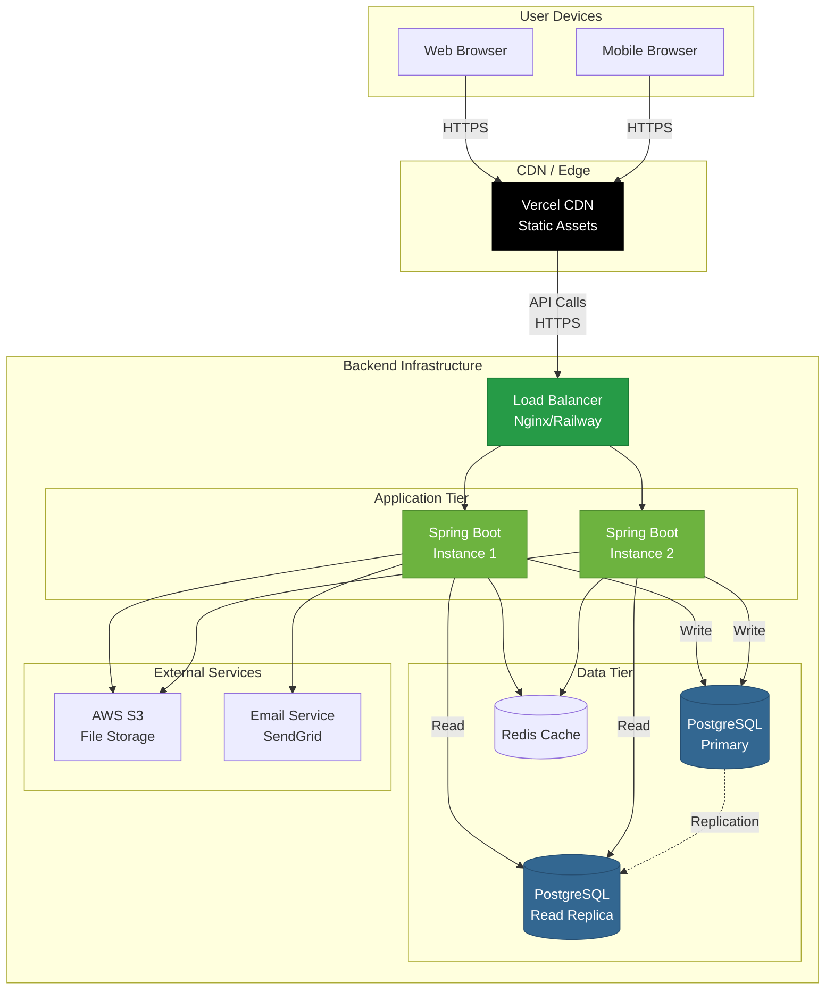

---

## 8. Authentication Flow

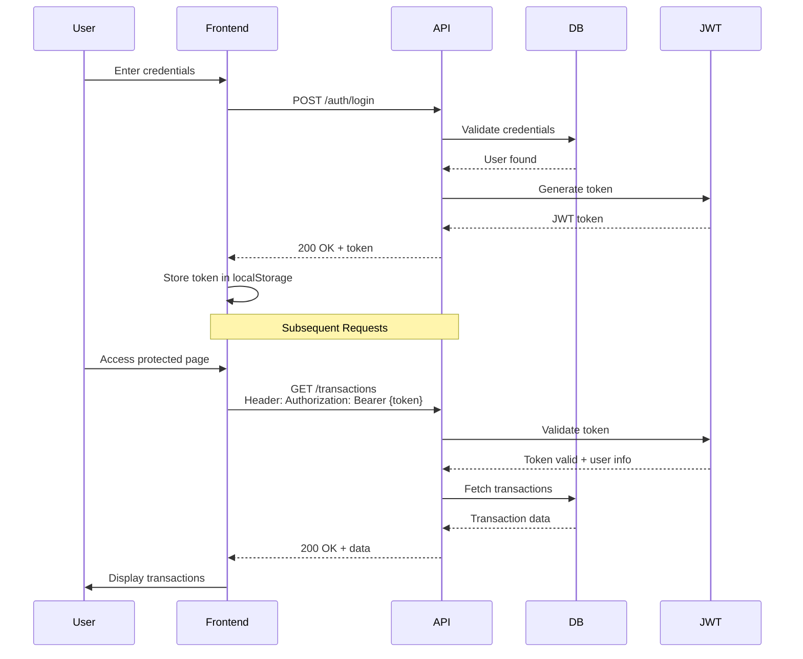

---

## 9. Transaction Creation Flow

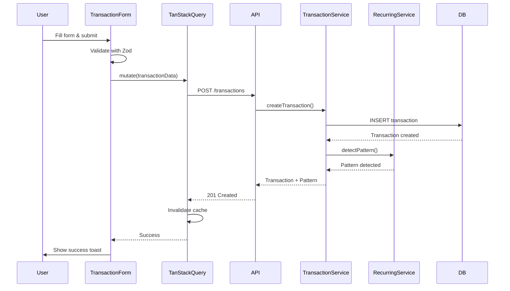

---

## 10. Budget Alert Flow

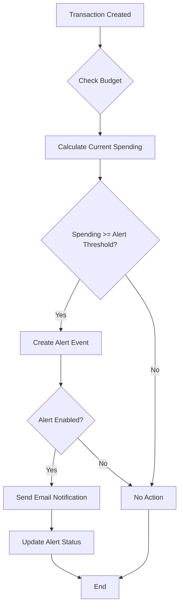

---

## 11. Recurring Pattern Detection Algorithm

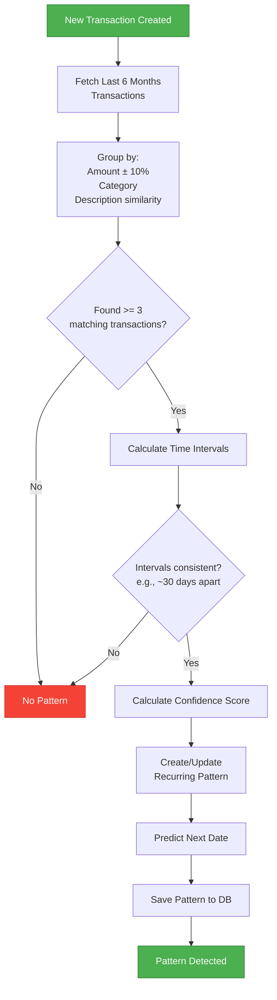

---

## 12. Database ER Diagram (Simplified)

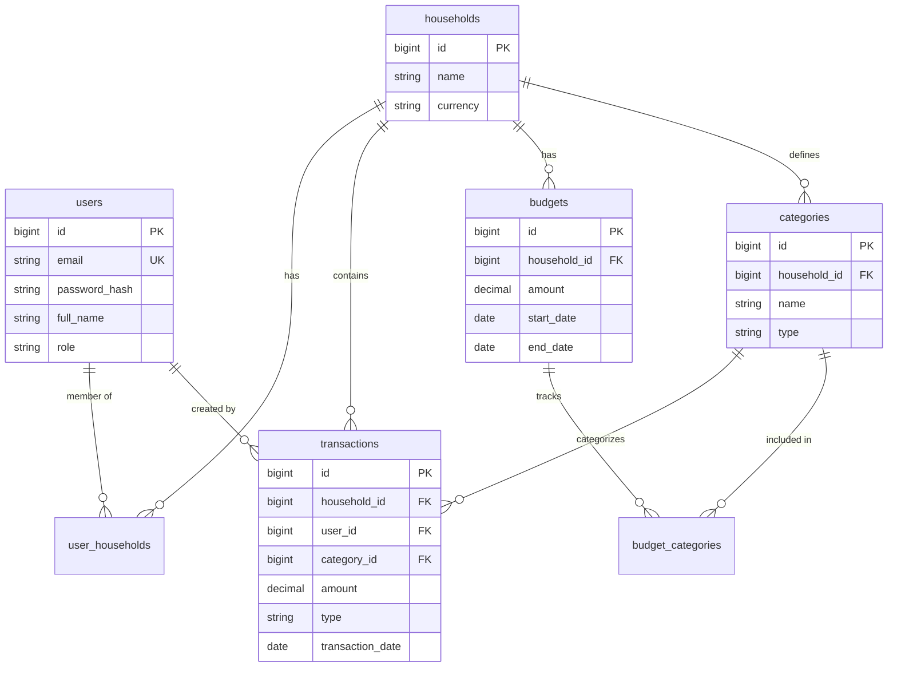

---

## 13. CI/CD Pipeline Flow

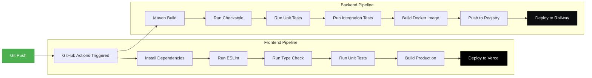

---

## 14. Caching Strategy

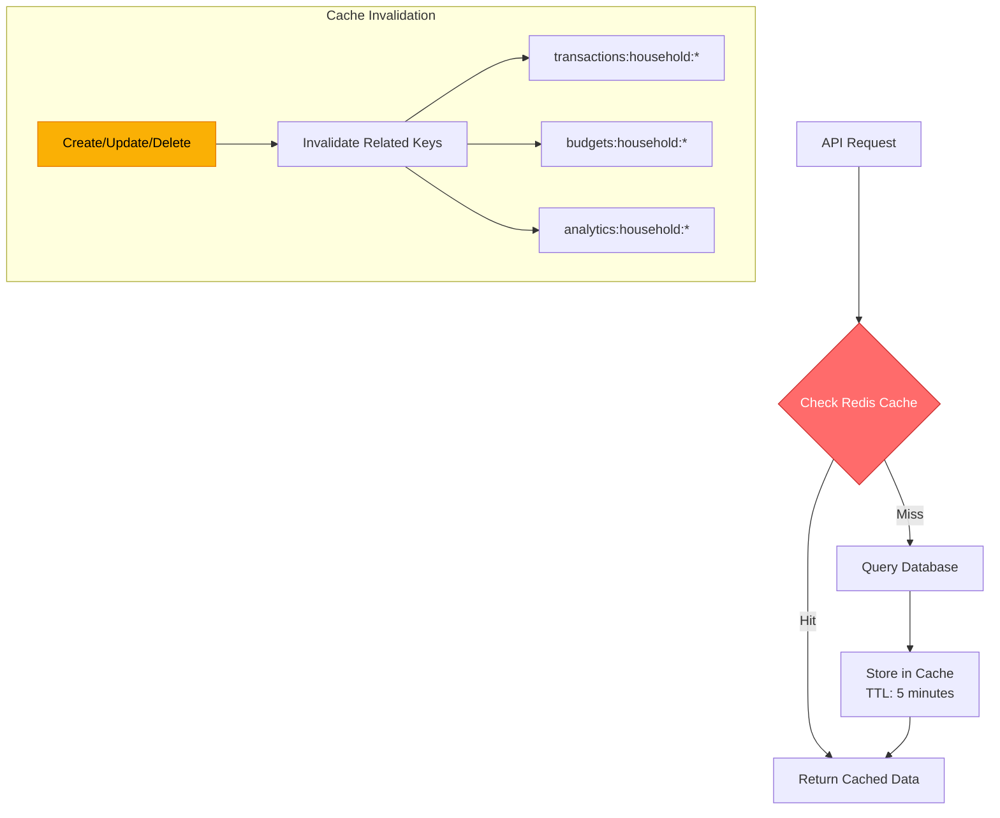

---

## 15. Security Layers

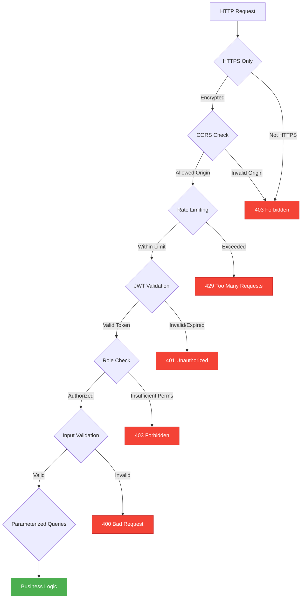

---

## 16. Responsive Design Breakpoints

```
Mobile First Approach:

┌─────────────────────────────────────────────────┐
│ xs: 0px - 639px (Mobile)                        │
│ - Single column layout                          │
│ - Bottom navigation                             │
│ - Collapsible filters                           │
└─────────────────────────────────────────────────┘

┌─────────────────────────────────────────────────┐
│ sm: 640px - 767px (Large Mobile / Small Tablet) │
│ - Two column grid (cards)                       │
│ - Side navigation drawer                        │
└─────────────────────────────────────────────────┘

┌─────────────────────────────────────────────────┐
│ md: 768px - 1023px (Tablet)                     │
│ - Sidebar visible                               │
│ - Three column grid                             │
│ - Expanded charts                               │
└─────────────────────────────────────────────────┘

┌─────────────────────────────────────────────────┐
│ lg: 1024px - 1279px (Desktop)                   │
│ - Full sidebar                                  │
│ - Multi-column layouts                          │
│ - All features visible                          │
└─────────────────────────────────────────────────┘

┌─────────────────────────────────────────────────┐
│ xl: 1280px+ (Large Desktop)                     │
│ - Maximum width container (1280px)              │
│ - Optimized spacing                             │
└─────────────────────────────────────────────────┘
```

---

## 17. State Management Architecture

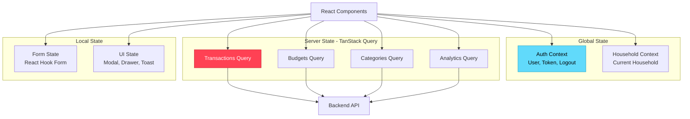

---

## Technology Stack Summary

| Layer | Technology | Purpose |
|-------|------------|---------|
| **Frontend** | React 18 + TypeScript | UI framework |
| | Vite | Build tool & dev server |
| | TailwindCSS | Utility-first styling |
| | shadcn/ui | Component library |
| | TanStack Query | Server state management |
| | React Router | Client-side routing |
| | Recharts | Data visualization |
| | React Hook Form + Zod | Form handling & validation |
| **Backend** | Spring Boot 3.2 | Application framework |
| | Spring Security 6 | Authentication & authorization |
| | Spring Data JPA | ORM & database access |
| | JJWT | JWT token generation |
| | Flyway | Database migrations |
| | Springdoc OpenAPI | API documentation |
| **Database** | PostgreSQL 15+ | Relational database |
| | Redis | Caching layer |
| **DevOps** | Docker | Containerization |
| | GitHub Actions | CI/CD pipeline |
| | Vercel | Frontend hosting |
| | Railway/Render | Backend hosting |
| | AWS S3 | File storage |

---

**Document Version:** 1.0  
**Last Updated:** August 4, 2026  
**Owner:** Architecture Team
