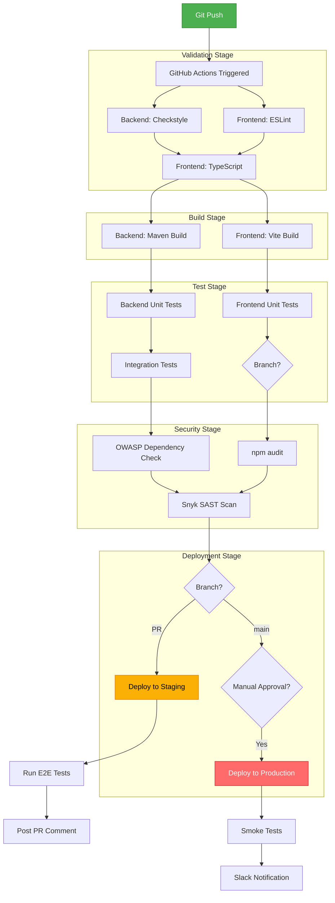

# DevOps Pipeline Specification

## Overview

Complete CI/CD pipeline specification for Expense Tracker application with automated testing, deployment, and monitoring.

**Philosophy:** Automate everything, fail fast, deploy frequently.

---

## 1. Environment Strategy

### 1.1 Environment Matrix

| Environment | Purpose | URL | Backend | Frontend | Database | Deployment |
|-------------|---------|-----|---------|----------|----------|------------|
| **Development** | Local dev | localhost | localhost:8080 | localhost:5173 | Docker Postgres | Manual |
| **Testing** | CI/CD tests | N/A | Testcontainers | N/A | Testcontainers | GitHub Actions |
| **Staging** | Pre-prod testing | staging.expensetracker.com | Railway | Vercel Preview | Railway Postgres | Auto on PR |
| **Production** | Live system | expensetracker.com | Railway | Vercel | Railway Postgres | Manual approval |

---

### 1.2 Environment Configuration

**Backend (Spring Boot) - application.yml**

```yaml
# application-dev.yml
spring:
  datasource:
    url: jdbc:postgresql://localhost:5432/expense_tracker
    username: postgres
    password: postgres
  jpa:
    show-sql: true
    hibernate:
      ddl-auto: validate
  flyway:
    enabled: true

jwt:
  secret: ${JWT_SECRET:dev-secret-key-change-in-production}
  expiration: 86400000  # 24 hours

logging:
  level:
    com.expensetracker: DEBUG
    org.hibernate.SQL: DEBUG
```

```yaml
# application-staging.yml
spring:
  datasource:
    url: ${DATABASE_URL}
    hikari:
      maximum-pool-size: 10
      minimum-idle: 5
  jpa:
    show-sql: false
    hibernate:
      ddl-auto: validate
  flyway:
    enabled: true

jwt:
  secret: ${JWT_SECRET}
  expiration: 86400000

logging:
  level:
    com.expensetracker: INFO
```

```yaml
# application-prod.yml
spring:
  datasource:
    url: ${DATABASE_URL}
    hikari:
      maximum-pool-size: 20
      minimum-idle: 10
      connection-timeout: 30000
  jpa:
    show-sql: false
    hibernate:
      ddl-auto: validate
  flyway:
    enabled: true
    baseline-on-migrate: false

jwt:
  secret: ${JWT_SECRET}
  expiration: 86400000

logging:
  level:
    com.expensetracker: WARN
    
# Redis cache configuration
spring:
  redis:
    host: ${REDIS_HOST}
    port: ${REDIS_PORT:6379}
    password: ${REDIS_PASSWORD}
```

**Frontend (.env files)**

```bash
# .env.development
VITE_API_BASE_URL=http://localhost:8080/api/v1
VITE_ENV=development
```

```bash
# .env.staging
VITE_API_BASE_URL=https://api-staging.expensetracker.com/api/v1
VITE_ENV=staging
```

```bash
# .env.production
VITE_API_BASE_URL=https://api.expensetracker.com/api/v1
VITE_ENV=production
```

---

### 1.3 Secrets Management

**GitHub Secrets (Required):**

| Secret Name | Used In | Description |
|-------------|---------|-------------|
| `DATABASE_URL` | Backend deployment | PostgreSQL connection string |
| `JWT_SECRET` | Backend deployment | 256-bit secret key for JWT |
| `REDIS_HOST` | Backend deployment | Redis cache hostname |
| `REDIS_PASSWORD` | Backend deployment | Redis authentication |
| `DOCKER_USERNAME` | Docker build | Docker Hub username |
| `DOCKER_PASSWORD` | Docker build | Docker Hub token |
| `VERCEL_TOKEN` | Frontend deployment | Vercel deployment token |
| `RAILWAY_TOKEN` | Backend deployment | Railway API token |
| `SNYK_TOKEN` | Security scan | Snyk authentication |

**Environment Variable Validation (Backend):**

```java
@Configuration
@ConfigurationProperties(prefix = "jwt")
@Validated
public class JwtProperties {
    
    @NotBlank(message = "JWT secret must be configured")
    @Size(min = 32, message = "JWT secret must be at least 32 characters")
    private String secret;
    
    @Min(value = 3600000, message = "JWT expiration must be at least 1 hour")
    private long expiration;
    
    // Getters and setters
}
```

---

## 2. CI/CD Pipeline Architecture



---

## 3. Branch Strategy

**Git Flow Model:**

```
main (production)
  ├── develop (integration)
  │    ├── feature/add-recurring-transactions
  │    ├── feature/budget-alerts
  │    └── bugfix/transaction-date-validation
  └── hotfix/critical-security-patch
```

**Branch Protection Rules:**

### main branch:
- ✓ Require pull request reviews (≥ 1 approval)
- ✓ Require status checks to pass
  - backend-tests
  - frontend-tests
  - security-scan
- ✓ Require branches to be up to date
- ✓ No force pushes
- ✓ No deletions

### develop branch:
- ✓ Require pull request reviews (≥ 1 approval)
- ✓ Require status checks to pass
- ✓ No force pushes

---

## 4. Docker Configuration

### 4.1 Backend Dockerfile

```dockerfile
# Multi-stage build for Spring Boot application

# Stage 1: Build
FROM maven:3.9-eclipse-temurin-17-alpine AS build
WORKDIR /app

# Copy pom.xml and download dependencies (cached layer)
COPY pom.xml .
RUN mvn dependency:go-offline -B

# Copy source and build
COPY src ./src
RUN mvn clean package -DskipTests -B

# Stage 2: Runtime
FROM eclipse-temurin:17-jre-alpine
WORKDIR /app

# Create non-root user
RUN addgroup -S spring && adduser -S spring -G spring
USER spring:spring

# Copy jar from build stage
COPY --from=build /app/target/*.jar app.jar

# Health check
HEALTHCHECK --interval=30s --timeout=3s --start-period=40s --retries=3 \
  CMD wget --no-verbose --tries=1 --spider http://localhost:8080/actuator/health || exit 1

# Expose port
EXPOSE 8080

# JVM options for container
ENV JAVA_OPTS="-XX:+UseContainerSupport -XX:MaxRAMPercentage=75.0 -XX:+UseG1GC"

# Run application
ENTRYPOINT ["sh", "-c", "java $JAVA_OPTS -jar app.jar"]
```

### 4.2 Frontend Dockerfile

```dockerfile
# Multi-stage build for React application

# Stage 1: Build
FROM node:18-alpine AS build
WORKDIR /app

# Copy package files
COPY package*.json ./
RUN npm ci --only=production

# Copy source and build
COPY . .
RUN npm run build

# Stage 2: Serve with nginx
FROM nginx:alpine
WORKDIR /usr/share/nginx/html

# Remove default nginx files
RUN rm -rf ./*

# Copy built files from build stage
COPY --from=build /app/dist .

# Copy nginx configuration
COPY nginx.conf /etc/nginx/conf.d/default.conf

# Health check
HEALTHCHECK --interval=30s --timeout=3s --start-period=10s --retries=3 \
  CMD wget --no-verbose --tries=1 --spider http://localhost:80/health || exit 1

EXPOSE 80

CMD ["nginx", "-g", "daemon off;"]
```

**nginx.conf:**

```nginx
server {
    listen 80;
    server_name _;
    
    root /usr/share/nginx/html;
    index index.html;
    
    # Gzip compression
    gzip on;
    gzip_types text/plain text/css application/json application/javascript text/xml application/xml application/xml+rss text/javascript;
    
    # Security headers
    add_header X-Frame-Options "SAMEORIGIN" always;
    add_header X-Content-Type-Options "nosniff" always;
    add_header X-XSS-Protection "1; mode=block" always;
    
    # Cache static assets
    location ~* \.(js|css|png|jpg|jpeg|gif|ico|svg|woff|woff2|ttf|eot)$ {
        expires 1y;
        add_header Cache-Control "public, immutable";
    }
    
    # SPA routing
    location / {
        try_files $uri $uri/ /index.html;
    }
    
    # Health check endpoint
    location /health {
        access_log off;
        return 200 "healthy\n";
        add_header Content-Type text/plain;
    }
}
```

### 4.3 Docker Compose (Local Development)

```yaml
version: '3.9'

services:
  postgres:
    image: postgres:15-alpine
    container_name: expense-tracker-db
    environment:
      POSTGRES_DB: expense_tracker
      POSTGRES_USER: postgres
      POSTGRES_PASSWORD: postgres
    ports:
      - "5432:5432"
    volumes:
      - postgres_data:/var/lib/postgresql/data
    healthcheck:
      test: ["CMD-SHELL", "pg_isready -U postgres"]
      interval: 10s
      timeout: 5s
      retries: 5

  redis:
    image: redis:7-alpine
    container_name: expense-tracker-cache
    ports:
      - "6379:6379"
    command: redis-server --appendonly yes
    volumes:
      - redis_data:/data
    healthcheck:
      test: ["CMD", "redis-cli", "ping"]
      interval: 10s
      timeout: 3s
      retries: 5

  backend:
    build:
      context: ./backend
      dockerfile: Dockerfile
    container_name: expense-tracker-api
    environment:
      SPRING_PROFILES_ACTIVE: dev
      SPRING_DATASOURCE_URL: jdbc:postgresql://postgres:5432/expense_tracker
      SPRING_DATASOURCE_USERNAME: postgres
      SPRING_DATASOURCE_PASSWORD: postgres
      SPRING_REDIS_HOST: redis
      JWT_SECRET: dev-secret-key-at-least-32-characters-long
    ports:
      - "8080:8080"
    depends_on:
      postgres:
        condition: service_healthy
      redis:
        condition: service_healthy
    restart: unless-stopped

  frontend:
    build:
      context: ./frontend
      dockerfile: Dockerfile
    container_name: expense-tracker-web
    ports:
      - "80:80"
    depends_on:
      - backend
    restart: unless-stopped

volumes:
  postgres_data:
  redis_data:
```

**Usage:**
```bash
# Start all services
docker-compose up -d

# View logs
docker-compose logs -f backend

# Stop all services
docker-compose down

# Rebuild and restart
docker-compose up -d --build
```

---

## 5. Local Development Setup

### 5.1 Prerequisites

```bash
# Check versions
java --version        # Java 17+
node --version        # Node 18+
mvn --version         # Maven 3.9+
docker --version      # Docker 24+
psql --version        # PostgreSQL 15+
```

### 5.2 Backend Setup

```bash
# Clone repository
git clone https://github.com/your-org/expense-tracker.git
cd expense-tracker/backend

# Start dependencies with Docker
docker-compose up -d postgres redis

# Install dependencies
mvn clean install

# Run migrations
mvn flyway:migrate

# Start application
mvn spring-boot:run

# Or with specific profile
mvn spring-boot:run -Dspring-boot.run.profiles=dev

# Run tests
mvn test                    # Unit tests
mvn verify                  # Integration tests
mvn jacoco:report          # Coverage report
```

### 5.3 Frontend Setup

```bash
cd expense-tracker/frontend

# Install dependencies
npm install

# Start dev server
npm run dev

# Run tests
npm run test:unit          # Unit tests
npm run test:e2e           # E2E tests (requires backend running)

# Lint and format
npm run lint
npm run format

# Type check
npm run type-check

# Build for production
npm run build
npm run preview            # Preview production build
```

### 5.4 Database Management

```bash
# Connect to database
psql -h localhost -U postgres -d expense_tracker

# Run SQL file
psql -h localhost -U postgres -d expense_tracker -f script.sql

# Backup database
pg_dump -h localhost -U postgres expense_tracker > backup.sql

# Restore database
psql -h localhost -U postgres -d expense_tracker < backup.sql

# Flyway commands
mvn flyway:info            # Show migration status
mvn flyway:migrate         # Run migrations
mvn flyway:clean           # Drop all objects (DEV ONLY!)
mvn flyway:validate        # Validate migrations
```

---

## 6. Monitoring & Logging

### 6.1 Application Metrics (Spring Boot Actuator)

**pom.xml:**
```xml
<dependency>
    <groupId>org.springframework.boot</groupId>
    <artifactId>spring-boot-starter-actuator</artifactId>
</dependency>
<dependency>
    <groupId>io.micrometer</groupId>
    <artifactId>micrometer-registry-prometheus</artifactId>
</dependency>
```

**application.yml:**
```yaml
management:
  endpoints:
    web:
      exposure:
        include: health,info,metrics,prometheus
  endpoint:
    health:
      show-details: when-authorized
  metrics:
    export:
      prometheus:
        enabled: true
```

**Health Check Endpoint:**
```
GET /actuator/health

Response:
{
  "status": "UP",
  "components": {
    "db": {
      "status": "UP",
      "details": {
        "database": "PostgreSQL",
        "validationQuery": "isValid()"
      }
    },
    "redis": {
      "status": "UP"
    },
    "diskSpace": {
      "status": "UP",
      "details": {
        "total": 500GB,
        "free": 250GB,
        "threshold": 10MB
      }
    }
  }
}
```

### 6.2 Logging Strategy

**Logback Configuration (logback-spring.xml):**

```xml
<?xml version="1.0" encoding="UTF-8"?>
<configuration>
    <include resource="org/springframework/boot/logging/logback/defaults.xml"/>
    
    <!-- Console appender -->
    <appender name="CONSOLE" class="ch.qos.logback.core.ConsoleAppender">
        <encoder>
            <pattern>%d{yyyy-MM-dd HH:mm:ss} - %msg%n</pattern>
        </encoder>
    </appender>
    
    <!-- File appender -->
    <appender name="FILE" class="ch.qos.logback.core.rolling.RollingFileAppender">
        <file>logs/expense-tracker.log</file>
        <rollingPolicy class="ch.qos.logback.core.rolling.TimeBasedRollingPolicy">
            <fileNamePattern>logs/expense-tracker-%d{yyyy-MM-dd}.log</fileNamePattern>
            <maxHistory>30</maxHistory>
        </rollingPolicy>
        <encoder>
            <pattern>%d{yyyy-MM-dd HH:mm:ss} [%thread] %-5level %logger{36} - %msg%n</pattern>
        </encoder>
    </appender>
    
    <!-- Root logger -->
    <root level="INFO">
        <appender-ref ref="CONSOLE"/>
        <appender-ref ref="FILE"/>
    </root>
    
    <!-- Application logger -->
    <logger name="com.expensetracker" level="DEBUG"/>
    
    <!-- Spring framework -->
    <logger name="org.springframework" level="INFO"/>
    
    <!-- Hibernate SQL -->
    <logger name="org.hibernate.SQL" level="DEBUG"/>
    <logger name="org.hibernate.type.descriptor.sql.BasicBinder" level="TRACE"/>
</configuration>
```

**Structured Logging Example:**

```java
@Slf4j
@RestController
public class TransactionController {
    
    @PostMapping("/transactions")
    public ResponseEntity<TransactionResponse> createTransaction(
        @RequestBody TransactionRequest request
    ) {
        log.info("Creating transaction: householdId={}, amount={}, type={}", 
            request.getHouseholdId(), 
            request.getAmount(), 
            request.getType()
        );
        
        try {
            TransactionResponse response = transactionService.create(request);
            log.info("Transaction created successfully: id={}", response.getId());
            return ResponseEntity.status(HttpStatus.CREATED).body(response);
        } catch (Exception e) {
            log.error("Failed to create transaction: {}", e.getMessage(), e);
            throw e;
        }
    }
}
```

---

**[Continued in next section...]**

## 7. GitHub Actions Workflows

### 7.1 Backend CI/CD Workflow

**.github/workflows/backend-ci-cd.yml:**

```yaml
name: Backend CI/CD

on:
  push:
    branches: [main, develop]
    paths:
      - 'backend/**'
      - '.github/workflows/backend-ci-cd.yml'
  pull_request:
    branches: [main, develop]
    paths:
      - 'backend/**'

env:
  JAVA_VERSION: '17'
  MAVEN_OPTS: -Xmx3g

jobs:
  validate:
    name: Code Quality Check
    runs-on: ubuntu-latest
    
    steps:
      - name: Checkout code
        uses: actions/checkout@v4
      
      - name: Set up JDK
        uses: actions/setup-java@v4
        with:
          java-version: ${{ env.JAVA_VERSION }}
          distribution: 'temurin'
          cache: 'maven'
      
      - name: Run Checkstyle
        working-directory: backend
        run: mvn checkstyle:check
      
      - name: Verify code formatting
        working-directory: backend
        run: mvn spotless:check

  test:
    name: Run Tests
    runs-on: ubuntu-latest
    needs: validate
    
    services:
      postgres:
        image: postgres:15-alpine
        env:
          POSTGRES_DB: expense_tracker_test
          POSTGRES_USER: test
          POSTGRES_PASSWORD: test
        ports:
          - 5432:5432
        options: >-
          --health-cmd pg_isready
          --health-interval 10s
          --health-timeout 5s
          --health-retries 5
      
      redis:
        image: redis:7-alpine
        ports:
          - 6379:6379
        options: >-
          --health-cmd "redis-cli ping"
          --health-interval 10s
          --health-timeout 5s
          --health-retries 5
    
    steps:
      - name: Checkout code
        uses: actions/checkout@v4
      
      - name: Set up JDK
        uses: actions/setup-java@v4
        with:
          java-version: ${{ env.JAVA_VERSION }}
          distribution: 'temurin'
          cache: 'maven'
      
      - name: Run unit tests
        working-directory: backend
        run: mvn test -B
        env:
          SPRING_PROFILES_ACTIVE: test
      
      - name: Run integration tests
        working-directory: backend
        run: mvn verify -B -Pintegration-test
        env:
          SPRING_PROFILES_ACTIVE: test
          DATABASE_URL: jdbc:postgresql://localhost:5432/expense_tracker_test
          DATABASE_USERNAME: test
          DATABASE_PASSWORD: test
      
      - name: Generate coverage report
        working-directory: backend
        run: mvn jacoco:report
      
      - name: Upload coverage to Codecov
        uses: codecov/codecov-action@v4
        with:
          files: backend/target/site/jacoco/jacoco.xml
          flags: backend
          name: backend-coverage
      
      - name: Check coverage threshold
        working-directory: backend
        run: mvn jacoco:check -Djacoco.minimum-coverage=0.80
      
      - name: Archive test results
        if: always()
        uses: actions/upload-artifact@v4
        with:
          name: backend-test-results
          path: backend/target/surefire-reports/

  security:
    name: Security Scan
    runs-on: ubuntu-latest
    needs: test
    
    steps:
      - name: Checkout code
        uses: actions/checkout@v4
      
      - name: Set up JDK
        uses: actions/setup-java@v4
        with:
          java-version: ${{ env.JAVA_VERSION }}
          distribution: 'temurin'
          cache: 'maven'
      
      - name: OWASP Dependency Check
        working-directory: backend
        run: mvn org.owasp:dependency-check-maven:check
      
      - name: Upload OWASP report
        if: always()
        uses: actions/upload-artifact@v4
        with:
          name: owasp-report
          path: backend/target/dependency-check-report.html
      
      - name: Snyk Security Scan
        uses: snyk/actions/maven@master
        continue-on-error: true
        env:
          SNYK_TOKEN: ${{ secrets.SNYK_TOKEN }}
        with:
          args: --severity-threshold=high

  build:
    name: Build & Push Docker Image
    runs-on: ubuntu-latest
    needs: [test, security]
    if: github.event_name == 'push'
    
    steps:
      - name: Checkout code
        uses: actions/checkout@v4
      
      - name: Set up Docker Buildx
        uses: docker/setup-buildx-action@v3
      
      - name: Log in to Docker Hub
        uses: docker/login-action@v3
        with:
          username: ${{ secrets.DOCKER_USERNAME }}
          password: ${{ secrets.DOCKER_PASSWORD }}
      
      - name: Extract metadata
        id: meta
        uses: docker/metadata-action@v5
        with:
          images: ${{ secrets.DOCKER_USERNAME }}/expense-tracker-backend
          tags: |
            type=ref,event=branch
            type=sha,prefix={{branch}}-
            type=raw,value=latest,enable={{is_default_branch}}
      
      - name: Build and push
        uses: docker/build-push-action@v5
        with:
          context: ./backend
          push: true
          tags: ${{ steps.meta.outputs.tags }}
          labels: ${{ steps.meta.outputs.labels }}
          cache-from: type=gha
          cache-to: type=gha,mode=max
      
      - name: Image digest
        run: echo ${{ steps.build.outputs.digest }}

  deploy-staging:
    name: Deploy to Staging
    runs-on: ubuntu-latest
    needs: build
    if: github.ref == 'refs/heads/develop'
    environment:
      name: staging
      url: https://api-staging.expensetracker.com
    
    steps:
      - name: Deploy to Railway (Staging)
        uses: bervProject/railway-deploy@main
        with:
          railway_token: ${{ secrets.RAILWAY_TOKEN }}
          service: expense-tracker-backend-staging
          environment: staging
      
      - name: Wait for deployment
        run: sleep 30
      
      - name: Health check
        run: |
          curl --fail https://api-staging.expensetracker.com/actuator/health || exit 1
      
      - name: Comment on PR
        if: github.event_name == 'pull_request'
        uses: actions/github-script@v7
        with:
          script: |
            github.rest.issues.createComment({
              issue_number: context.issue.number,
              owner: context.repo.owner,
              repo: context.repo.repo,
              body: '✅ Backend deployed to staging: https://api-staging.expensetracker.com'
            })

  deploy-production:
    name: Deploy to Production
    runs-on: ubuntu-latest
    needs: build
    if: github.ref == 'refs/heads/main'
    environment:
      name: production
      url: https://api.expensetracker.com
    
    steps:
      - name: Deploy to Railway (Production)
        uses: bervProject/railway-deploy@main
        with:
          railway_token: ${{ secrets.RAILWAY_TOKEN }}
          service: expense-tracker-backend-prod
          environment: production
      
      - name: Wait for deployment
        run: sleep 30
      
      - name: Smoke tests
        run: |
          curl --fail https://api.expensetracker.com/actuator/health || exit 1
          curl --fail https://api.expensetracker.com/actuator/info || exit 1
      
      - name: Notify Slack
        uses: slackapi/slack-github-action@v1
        with:
          payload: |
            {
              "text": "🚀 Backend deployed to production successfully!",
              "blocks": [
                {
                  "type": "section",
                  "text": {
                    "type": "mrkdwn",
                    "text": "*Expense Tracker Backend Deployment*\n✅ Deployed to production\n🔗 <https://api.expensetracker.com|API URL>"
                  }
                }
              ]
            }
        env:
          SLACK_WEBHOOK_URL: ${{ secrets.SLACK_WEBHOOK_URL }}
```

---

### 7.2 Frontend CI/CD Workflow

**.github/workflows/frontend-ci-cd.yml:**

```yaml
name: Frontend CI/CD

on:
  push:
    branches: [main, develop]
    paths:
      - 'frontend/**'
      - '.github/workflows/frontend-ci-cd.yml'
  pull_request:
    branches: [main, develop]
    paths:
      - 'frontend/**'

env:
  NODE_VERSION: '18'

jobs:
  validate:
    name: Code Quality Check
    runs-on: ubuntu-latest
    
    steps:
      - name: Checkout code
        uses: actions/checkout@v4
      
      - name: Setup Node.js
        uses: actions/setup-node@v4
        with:
          node-version: ${{ env.NODE_VERSION }}
          cache: 'npm'
          cache-dependency-path: frontend/package-lock.json
      
      - name: Install dependencies
        working-directory: frontend
        run: npm ci
      
      - name: Run ESLint
        working-directory: frontend
        run: npm run lint
      
      - name: Check code formatting
        working-directory: frontend
        run: npm run format:check
      
      - name: TypeScript type check
        working-directory: frontend
        run: npm run type-check

  test:
    name: Run Tests
    runs-on: ubuntu-latest
    needs: validate
    
    steps:
      - name: Checkout code
        uses: actions/checkout@v4
      
      - name: Setup Node.js
        uses: actions/setup-node@v4
        with:
          node-version: ${{ env.NODE_VERSION }}
          cache: 'npm'
          cache-dependency-path: frontend/package-lock.json
      
      - name: Install dependencies
        working-directory: frontend
        run: npm ci
      
      - name: Run unit tests
        working-directory: frontend
        run: npm run test:unit -- --coverage
      
      - name: Upload coverage to Codecov
        uses: codecov/codecov-action@v4
        with:
          files: frontend/coverage/coverage-final.json
          flags: frontend
          name: frontend-coverage
      
      - name: Archive test results
        if: always()
        uses: actions/upload-artifact@v4
        with:
          name: frontend-test-results
          path: frontend/coverage/

  security:
    name: Security Scan
    runs-on: ubuntu-latest
    needs: test
    
    steps:
      - name: Checkout code
        uses: actions/checkout@v4
      
      - name: Setup Node.js
        uses: actions/setup-node@v4
        with:
          node-version: ${{ env.NODE_VERSION }}
          cache: 'npm'
          cache-dependency-path: frontend/package-lock.json
      
      - name: npm audit
        working-directory: frontend
        run: npm audit --audit-level=moderate
        continue-on-error: true
      
      - name: Snyk Security Scan
        uses: snyk/actions/node@master
        continue-on-error: true
        env:
          SNYK_TOKEN: ${{ secrets.SNYK_TOKEN }}
        with:
          args: --severity-threshold=high

  build:
    name: Build Application
    runs-on: ubuntu-latest
    needs: [test, security]
    
    steps:
      - name: Checkout code
        uses: actions/checkout@v4
      
      - name: Setup Node.js
        uses: actions/setup-node@v4
        with:
          node-version: ${{ env.NODE_VERSION }}
          cache: 'npm'
          cache-dependency-path: frontend/package-lock.json
      
      - name: Install dependencies
        working-directory: frontend
        run: npm ci
      
      - name: Build production bundle
        working-directory: frontend
        run: npm run build
        env:
          VITE_API_BASE_URL: https://api.expensetracker.com/api/v1
      
      - name: Archive build artifacts
        uses: actions/upload-artifact@v4
        with:
          name: dist
          path: frontend/dist/
      
      - name: Run Lighthouse CI
        uses: treosh/lighthouse-ci-action@v10
        with:
          urls: |
            http://localhost:4173/
          uploadArtifacts: true
          temporaryPublicStorage: true
          configPath: frontend/lighthouserc.js

  e2e-test:
    name: E2E Tests
    runs-on: ubuntu-latest
    needs: build
    if: github.event_name == 'pull_request'
    
    services:
      postgres:
        image: postgres:15-alpine
        env:
          POSTGRES_DB: expense_tracker_test
          POSTGRES_USER: test
          POSTGRES_PASSWORD: test
        ports:
          - 5432:5432
    
    steps:
      - name: Checkout code
        uses: actions/checkout@v4
      
      - name: Setup Node.js
        uses: actions/setup-node@v4
        with:
          node-version: ${{ env.NODE_VERSION }}
          cache: 'npm'
          cache-dependency-path: frontend/package-lock.json
      
      - name: Install dependencies
        working-directory: frontend
        run: npm ci
      
      - name: Install Playwright browsers
        working-directory: frontend
        run: npx playwright install --with-deps chromium
      
      - name: Start backend service
        working-directory: backend
        run: |
          mvn spring-boot:start -Dspring-boot.run.profiles=test &
          sleep 30
      
      - name: Run E2E tests
        working-directory: frontend
        run: npm run test:e2e
        env:
          VITE_API_BASE_URL: http://localhost:8080/api/v1
      
      - name: Upload Playwright report
        if: always()
        uses: actions/upload-artifact@v4
        with:
          name: playwright-report
          path: frontend/playwright-report/

  deploy-preview:
    name: Deploy Preview (Vercel)
    runs-on: ubuntu-latest
    needs: build
    if: github.event_name == 'pull_request'
    
    steps:
      - name: Checkout code
        uses: actions/checkout@v4
      
      - name: Deploy to Vercel Preview
        uses: amondnet/vercel-action@v25
        with:
          vercel-token: ${{ secrets.VERCEL_TOKEN }}
          vercel-org-id: ${{ secrets.VERCEL_ORG_ID }}
          vercel-project-id: ${{ secrets.VERCEL_PROJECT_ID }}
          working-directory: frontend
          scope: ${{ secrets.VERCEL_ORG_ID }}
      
      - name: Comment PR with preview URL
        uses: actions/github-script@v7
        with:
          script: |
            github.rest.issues.createComment({
              issue_number: context.issue.number,
              owner: context.repo.owner,
              repo: context.repo.repo,
              body: '✅ Preview deployed: ${{ steps.deploy.outputs.preview-url }}'
            })

  deploy-staging:
    name: Deploy to Staging
    runs-on: ubuntu-latest
    needs: build
    if: github.ref == 'refs/heads/develop'
    environment:
      name: staging
      url: https://staging.expensetracker.com
    
    steps:
      - name: Checkout code
        uses: actions/checkout@v4
      
      - name: Deploy to Vercel Staging
        uses: amondnet/vercel-action@v25
        with:
          vercel-token: ${{ secrets.VERCEL_TOKEN }}
          vercel-org-id: ${{ secrets.VERCEL_ORG_ID }}
          vercel-project-id: ${{ secrets.VERCEL_PROJECT_ID }}
          vercel-args: '--prod'
          alias-domains: staging.expensetracker.com
          working-directory: frontend

  deploy-production:
    name: Deploy to Production
    runs-on: ubuntu-latest
    needs: build
    if: github.ref == 'refs/heads/main'
    environment:
      name: production
      url: https://expensetracker.com
    
    steps:
      - name: Checkout code
        uses: actions/checkout@v4
      
      - name: Deploy to Vercel Production
        uses: amondnet/vercel-action@v25
        id: deploy
        with:
          vercel-token: ${{ secrets.VERCEL_TOKEN }}
          vercel-org-id: ${{ secrets.VERCEL_ORG_ID }}
          vercel-project-id: ${{ secrets.VERCEL_PROJECT_ID }}
          vercel-args: '--prod'
          alias-domains: expensetracker.com,www.expensetracker.com
          working-directory: frontend
      
      - name: Notify Slack
        uses: slackapi/slack-github-action@v1
        with:
          payload: |
            {
              "text": "🚀 Frontend deployed to production successfully!",
              "blocks": [
                {
                  "type": "section",
                  "text": {
                    "type": "mrkdwn",
                    "text": "*Expense Tracker Frontend Deployment*\n✅ Deployed to production\n🔗 <https://expensetracker.com|Live URL>"
                  }
                }
              ]
            }
        env:
          SLACK_WEBHOOK_URL: ${{ secrets.SLACK_WEBHOOK_URL }}
```

---

### 7.3 Database Migration Workflow

**.github/workflows/database-migration.yml:**

```yaml
name: Database Migration

on:
  workflow_dispatch:
    inputs:
      environment:
        description: 'Target environment'
        required: true
        type: choice
        options:
          - staging
          - production
      dry_run:
        description: 'Dry run (validate only)'
        required: false
        type: boolean
        default: true

jobs:
  migrate:
    name: Run Database Migration
    runs-on: ubuntu-latest
    environment: ${{ github.event.inputs.environment }}
    
    steps:
      - name: Checkout code
        uses: actions/checkout@v4
      
      - name: Set up JDK
        uses: actions/setup-java@v4
        with:
          java-version: '17'
          distribution: 'temurin'
          cache: 'maven'
      
      - name: Validate migrations
        working-directory: backend
        run: mvn flyway:validate
        env:
          DATABASE_URL: ${{ secrets.DATABASE_URL }}
      
      - name: Check migration status
        working-directory: backend
        run: mvn flyway:info
        env:
          DATABASE_URL: ${{ secrets.DATABASE_URL }}
      
      - name: Run migration (dry run)
        if: github.event.inputs.dry_run == 'true'
        working-directory: backend
        run: echo "Dry run - would execute migrations"
      
      - name: Run migration (actual)
        if: github.event.inputs.dry_run == 'false'
        working-directory: backend
        run: mvn flyway:migrate
        env:
          DATABASE_URL: ${{ secrets.DATABASE_URL }}
      
      - name: Backup database
        if: github.event.inputs.dry_run == 'false' && github.event.inputs.environment == 'production'
        run: |
          echo "Creating backup..."
          # Add backup logic here
      
      - name: Notify on success
        if: success()
        uses: slackapi/slack-github-action@v1
        with:
          payload: |
            {
              "text": "✅ Database migration completed for ${{ github.event.inputs.environment }}"
            }
        env:
          SLACK_WEBHOOK_URL: ${{ secrets.SLACK_WEBHOOK_URL }}
      
      - name: Notify on failure
        if: failure()
        uses: slackapi/slack-github-action@v1
        with:
          payload: |
            {
              "text": "❌ Database migration FAILED for ${{ github.event.inputs.environment }}!"
            }
        env:
          SLACK_WEBHOOK_URL: ${{ secrets.SLACK_WEBHOOK_URL }}
```

---

## 8. Deployment Checklist

### 8.1 Pre-Deployment Checklist

**Before deploying to production:**

- [ ] All tests passing (unit, integration, E2E)
- [ ] Code review approved by at least 1 team member
- [ ] Security scan completed with no critical vulnerabilities
- [ ] Database migration tested in staging
- [ ] Performance tests passed
- [ ] Documentation updated (API docs, README)
- [ ] Feature flags configured (if applicable)
- [ ] Rollback plan prepared
- [ ] Team notified of deployment window
- [ ] Monitoring dashboards ready

---

### 8.2 Post-Deployment Checklist

**After production deployment:**

- [ ] Smoke tests passed
- [ ] Health check endpoints returning 200 OK
- [ ] Key user flows tested manually
- [ ] Error rates monitored (< 1% acceptable)
- [ ] Response times within SLA (< 500ms p95)
- [ ] Database queries optimized (no N+1 issues)
- [ ] Logs reviewed for errors
- [ ] Metrics dashboard showing normal behavior
- [ ] Team notified of successful deployment
- [ ] Git tag created for release

---

### 8.3 Rollback Procedure

**If issues detected post-deployment:**

```bash
# 1. Revert to previous Docker image
railway rollback --service expense-tracker-backend-prod

# 2. Revert Vercel deployment
vercel rollback --token $VERCEL_TOKEN

# 3. Revert database migration (if needed)
mvn flyway:undo

# 4. Verify rollback
curl https://api.expensetracker.com/actuator/health

# 5. Notify team
# Post in Slack #incidents channel
```

---

## 9. Performance Optimization

### 9.1 Backend Optimizations

**Database Connection Pooling:**
```yaml
spring:
  datasource:
    hikari:
      maximum-pool-size: 20
      minimum-idle: 10
      connection-timeout: 30000
      idle-timeout: 600000
      max-lifetime: 1800000
```

**Redis Caching:**
```java
@Cacheable(value = "transactions", key = "#householdId")
public List<Transaction> getRecentTransactions(Long householdId) {
    return transactionRepository.findTop50ByHouseholdId(householdId);
}

@CacheEvict(value = "transactions", key = "#transaction.householdId")
public Transaction createTransaction(Transaction transaction) {
    return transactionRepository.save(transaction);
}
```

**Database Indexes:**
```sql
CREATE INDEX CONCURRENTLY idx_transactions_household_date 
ON transactions(household_id, transaction_date DESC);

CREATE INDEX CONCURRENTLY idx_transactions_category 
ON transactions(category_id) WHERE category_id IS NOT NULL;
```

---

### 9.2 Frontend Optimizations

**Code Splitting:**
```typescript
// routes.tsx
const DashboardPage = lazy(() => import('./pages/DashboardPage'));
const TransactionsPage = lazy(() => import('./pages/TransactionsPage'));
const BudgetsPage = lazy(() => import('./pages/BudgetsPage'));

<Suspense fallback={<LoadingSpinner />}>
  <Routes>
    <Route path="/dashboard" element={<DashboardPage />} />
    <Route path="/transactions" element={<TransactionsPage />} />
    <Route path="/budgets" element={<BudgetsPage />} />
  </Routes>
</Suspense>
```

**Bundle Size Optimization:**
```javascript
// vite.config.ts
export default defineConfig({
  build: {
    rollupOptions: {
      output: {
        manualChunks: {
          'react-vendor': ['react', 'react-dom', 'react-router-dom'],
          'query-vendor': ['@tanstack/react-query'],
          'ui-vendor': ['@radix-ui/react-dialog', '@radix-ui/react-dropdown-menu'],
          'chart-vendor': ['recharts'],
        },
      },
    },
    chunkSizeWarningLimit: 1000,
  },
});
```

**Image Optimization:**
```typescript
// Use WebP with fallback
<picture>
  <source srcSet="/image.webp" type="image/webp" />
  
</picture>
```

---

## 10. Disaster Recovery

### 10.1 Backup Strategy

**Database Backups:**
```bash
# Automated daily backups (cron job)
0 2 * * * pg_dump -h $DB_HOST -U $DB_USER expense_tracker | gzip > /backups/expense_tracker_$(date +\%Y\%m\%d).sql.gz

# Retain backups for 30 days
find /backups -name "expense_tracker_*.sql.gz" -mtime +30 -delete
```

**Application State Backup:**
- Database snapshots: Daily (retained 30 days)
- Transaction logs: Continuous archiving
- Configuration files: Version controlled in Git
- Secrets: Stored in GitHub Secrets + 1Password

---

### 10.2 Recovery Procedures

**Database Restore:**
```bash
# Stop application
railway stop --service expense-tracker-backend-prod

# Restore from backup
gunzip < backup_20260804.sql.gz | psql -h $DB_HOST -U $DB_USER expense_tracker

# Verify data integrity
psql -h $DB_HOST -U $DB_USER -d expense_tracker -c "SELECT COUNT(*) FROM transactions;"

# Restart application
railway start --service expense-tracker-backend-prod
```

**Recovery Time Objective (RTO):** < 1 hour  
**Recovery Point Objective (RPO):** < 24 hours

---

**Document Version:** 1.0  
**Last Updated:** August 4, 2026  
**Owner:** DevOps Team
